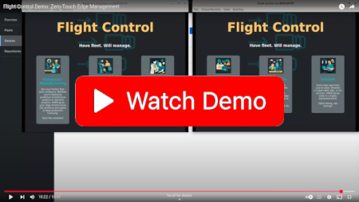

<p align="center">
  
</p>

<p align="center">
  <strong>Declarative management of fleets of edge devices and their workloads.</strong>
</p>

<p align="center">
  <a href="https://github.com/flightctl/flightctl/actions/workflows/lint.yaml"></a>
  <a href="https://github.com/flightctl/flightctl/actions/workflows/unit-tests.yaml"></a>
  <a href="https://github.com/flightctl/flightctl/actions/workflows/integration-tests.yaml"></a>
  <a href="https://github.com/flightctl/flightctl/actions/workflows/lint-openapi.yaml"></a>
  <a href="LICENSE"></a>
  <a href="go.mod"></a>
  <a href="https://quay.io/organization/flightctl"></a>
</p>

<p align="center">
  <a href="docs/user/README.md">User Documentation</a> •
  <a href="docs/developer/README.md">Developer Documentation</a> •
  <a href="CONTRIBUTING.md">Contributing</a>
</p>

---

## Overview

Flight Control aims to provide simple, scalable, and secure management of edge devices and applications. Users declare the operating system version, host configuration, and set of applications they want to run on an individual device or a whole fleet of devices, and Flight Control rolls out the target configuration to devices. A device agent running on each device automatically applies changes and reports progress and health status back.

Flight Control is designed for modern, container-centric toolchains and operational best practices. It works best on image-based Linux operating systems running **bootc** or **ostree**, with container workloads running on **Podman/Docker** or **Kubernetes (MicroShift)**. APIs are Kubernetes-like, so they instantly feel familiar to Kubernetes users and allow reuse of existing tools and toolchains.

## Demo

<p align="center">
  <a href="https://www.youtube.com/watch?v=WzNG_uWnmzk">
    
  </a>
</p>

## Architecture

<picture>
  <source media="(prefers-color-scheme: light)" srcset="https://raw.githubusercontent.com/flightctl/flightctl/main/docs/images/flightctl-highlevel-architecture.svg"/>
  <source media="(prefers-color-scheme: dark)" srcset="https://raw.githubusercontent.com/flightctl/flightctl/main/docs/images/flightctl-highlevel-architecture-dark.svg"/>
  
</picture>

The **Flight Control Service** exposes two API endpoints — a user-facing HTTPS endpoint (authenticated via JWT from an external OIDC provider) and an agent-facing mTLS endpoint (authenticated via device certificates bootstrapped from hardware root-of-trust). The **Flight Control Agent** runs on each managed device, calls home, polls for target configuration, applies updates autonomously, and reports status back.

## Key Features

- **Declarative / GitOps API** — Kubernetes-like API lets you store fleet and device configuration in Git; `ResourceSync` polls repositories or receives webhooks.
- **Fleet management** — Define a device template and rollout policy once; it automatically applies to all current and future member devices. Supports disruption budgets and staged rollouts.
- **Secure device lifecycle** — Friction-free enrollment, automatic certificate rotation, TPM-backed attestation, and decommissioning.
- **OS image updates** — OTA updates via bootc or rpm-ostree with transactional rollback (Greenboot integration). The agent downloads assets before applying, so updates survive network interruptions.
- **Container and VM workloads** — Podman containers (docker-compose, Quadlets), MicroShift/Kubernetes workloads (Helm, kustomize).
- **OS image building** — `ImageBuild` produces bootc container images with the embedded agent; `ImageExport` exports to qcow2, vmdk, or iso.
- **Remote console** — Live console sessions to managed devices directly from the CLI or UI.
- **Pluggable auth and RBAC** — Keycloak, generic OIDC, OpenShift OAuth, AAP, PAM; SpiceDB or Kubernetes RBAC for authorization.
- **Observability** — Prometheus metrics, Alertmanager integration, OpenTelemetry telemetry gateway, and a CVE view at device and fleet level.
- **Web UI** — Browser-based dashboard for device inventory, fleet management, and ClickOps workflows.

## Quick Start

The fastest path to a running local environment uses [kind](https://kind.sigs.k8s.io/) (Kubernetes in Docker):

```bash
# 1. Build all binaries
make build

# 2. Deploy to a local kind cluster (builds containers, installs Helm chart)
make deploy

# 3. Authenticate with the CLI
# The server URL is written to ~/.flightctl/client.yaml by make deploy
bin/flightctl login $(cat ~/.flightctl/client.yaml | grep server | awk '{print $2}') --web --certificate-authority ~/.flightctl/certs/ca.crt

# 4. Apply an example fleet and verify
bin/flightctl apply -f examples/fleet.yaml
bin/flightctl get fleets
bin/flightctl get devices
```

For a Linux-native setup using systemd + Podman (no Kubernetes required):

```bash
make deploy-quadlets
```

Certificates and client configuration are written to `~/.flightctl/`.

## Prerequisites

| Tool | Minimum version | Notes |
|------|----------------|-------|
| `go` | 1.25 | Required to build |
| `make` | any | Build orchestration |
| `podman` | any | Container builds and integration tests |
| `openssl` / `openssl-devel` | any | TLS certificate generation |
| `buildah` | any | Container image builds |
| `pam-devel` | any | PAM issuer build |
| `kind` | ≥ 0.31.0 | Local Kubernetes cluster (`make deploy`) |
| `kubectl` | any | Kubernetes interaction |

For agent development, enable the Podman socket:

```bash
systemctl --user enable --now podman.socket
```

## Build & Test

| Make target | Description |
|-------------|-------------|
| `make build` | Build all binaries |
| `make generate` | Re-generate API client code and mocks |
| `make generate-proto` | Re-generate gRPC protobuf bindings |
| `make unit-test` | Run unit tests (requires `gotestsum`) |
| `make integration-test` | Run integration tests (requires Podman; starts Postgres, Redis, Alertmanager via testcontainers) |
| `make e2e-test` | Run end-to-end tests against a kind cluster |
| `make lint` | Run `golangci-lint` (installs automatically) |
| `make lint-openapi` | Lint OpenAPI specs |
| `make lint-docs` | Lint user documentation (markdownlint) |
| `make tidy` | Tidy `go.mod` files |
| `make clean` | Remove containers and volumes |
| `make clean-all` | Full cleanup including `bin/` |

Install test tooling:

```bash
go install gotest.tools/gotestsum@latest
go install go.uber.org/mock/mockgen@v0.4.0
```

Integration tests accept these environment variables: `INTEGRATION_PROCS=N` for parallelism, `TEST_DIR=./test/integration/store` for a specific suite, `INTEGRATION_GINKGO_FOCUS="pattern"` for individual tests.

## Deployment Options

| Method | Command / Notes |
|--------|----------------|
| **Kind** (local dev) | `make deploy` — builds containers, deploys Helm chart to a kind cluster |
| **Quadlets** (Linux/systemd) | `make deploy-quadlets` or install the `flightctl-services` RPM and `systemctl start flightctl.target` |
| **Kubernetes / OpenShift** | `helm install my-flightctl oci://quay.io/flightctl/charts/flightctl` — requires Gateway API and cert-manager |
| **MicroShift** | Same Helm chart; see [installing on Kubernetes](docs/user/installing/installing-service-on-kubernetes.md) |
| **Disconnected / air-gapped** | See [disconnected OpenShift install guide](docs/user/installing/installing-service-on-openshift-disconnected.md) |
| **Linux RPM** | `sudo dnf config-manager addrepo https://rpm.flightctl.io/flightctl-epel.repo && sudo dnf install -y flightctl-services` |

Pre-built container images are published to `quay.io/flightctl/` for each release. Helm charts are published to `oci://quay.io/flightctl/charts/flightctl`.

## CLI Reference

The `flightctl` CLI communicates with the Flight Control Service to manage resources.

| Command | Description |
|---------|-------------|
| `login` | Authenticate (OIDC web flow, token, or PAM) |
| `get` | List or describe resources (devices, fleets, enrollmentrequests, …) |
| `apply` | Create or update resources from a YAML file |
| `edit` | Open a resource in your editor for interactive editing |
| `delete` | Delete resources |
| `approve` / `deny` | Approve or deny enrollment requests |
| `decommission` | Decommission a device |
| `console` | Open a remote console session to a device |
| `certificate` | Manage certificates |
| `logs` | Stream logs from an ImageBuild or ImageExport |
| `download` | Download an ImageExport artifact |
| `cancel` | Cancel a running operation |
| `version` | Print CLI and server versions |
| `completion` | Generate shell completion scripts |

Output formats: `table` (default), `json`, `yaml`, `wide`. Configuration defaults to `~/.config/flightctl/client.yaml`.

For the full reference see [CLI documentation](docs/user/references/cli-commands.md).

## Core Concepts

| Concept | Description |
|---------|-------------|
| **Device** | A (real or virtual) machine together with its OS and application workloads. |
| **Fleet** | A group of devices governed by a common device template and management policies. |
| **Device Template** | A template for device specifications that controls configuration drift across a fleet. |
| **Labels** | Key-value pairs for organizing devices (e.g. `region=emea`, `site=factory-berlin`). |
| **ResourceSync** | Polls a Git repository (or receives a webhook) and syncs Fleet/Device resources from it. |
| **Agent** | The Flight Control Agent process that runs on each managed device, enrolls it, applies updates, and reports status. |

See [Introduction](docs/user/introduction.md) for a full explanation of all concepts.

## Documentation

| Area | Link |
|------|------|
| User documentation (install, configure, use) | [docs/user/README.md](docs/user/README.md) |
| Developer documentation (build, run, architecture) | [docs/developer/README.md](docs/developer/README.md) |
| Installing on Kubernetes / OpenShift | [docs/user/installing/](docs/user/installing/) |
| Installing the agent | [docs/user/installing/installing-agent.md](docs/user/installing/installing-agent.md) |
| API resources reference | [docs/user/references/api-resources.md](docs/user/references/api-resources.md) |
| Architecture | [docs/developer/architecture/](docs/developer/architecture/) |
| Enhancement proposals (FEPs) | [docs/developer/enhancements/](docs/developer/enhancements/) |

## Contributing

Contributions are welcome! Please read [CONTRIBUTING.md](CONTRIBUTING.md) for the full workflow and then [docs/developer/README.md](docs/developer/README.md) for build and development setup.

Key rules:

- **Signed commits** are required (GPG or SSH).
- **Commit message prefix** — use a Jira issue key (`EDM-1234: description`) or `NO-ISSUE:` for trivial changes.
- **Before pushing** — run `make unit-test`, `make integration-test`, and `make lint`. Fix any failures.
- **API changes** — edit OpenAPI YAML and hand-maintained types, then run `make generate`. Do not edit `*.gen.go` by hand.

For larger changes, consider opening a Flight Control Enhancement Proposal (FEP) under `docs/developer/enhancements/` before implementing.

## Related Projects

- [flightctl-ansible](https://github.com/flightctl/flightctl-ansible) — Ansible collection for Flight Control
- [flightctl-ui](https://github.com/flightctl/flightctl-ui) — Web UI

## License

Flight Control is licensed under the [Apache License 2.0](LICENSE).
