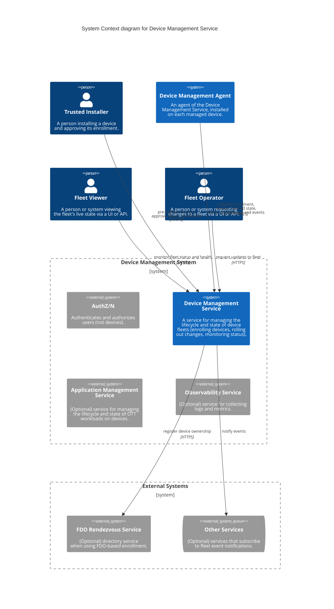
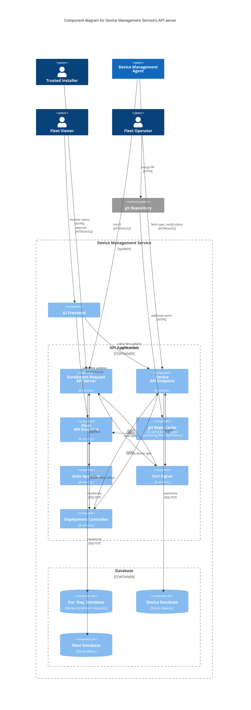
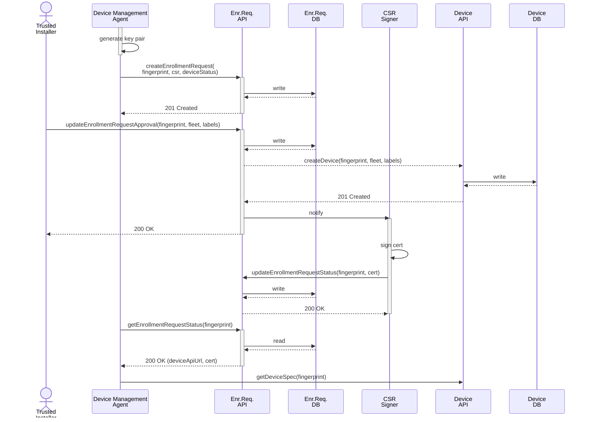

# Architecture

## System Context

```mermaid
C4Context
    title System Context diagram for Device Management Service

    Person(installer, "Trusted Installer", "A person installing a device<br/>and approving its enrollment.")
    System(dma, "Device Management Agent", "An agent of the Device<br/>Management Service, installed<br/>on each managed device.")
    Person(viewer, "Fleet Viewer", "A person or system viewing<br/>the fleet's live state via a UI or API.")
    Person(operator, "Fleet Operator", "A person or system requesting<br/>changes to a fleet via a UI or API.")

    Boundary(system, "Device Management System") {
        System_Ext(auth, "AuthZ/N", "Authenticates and authorizes<br/>users (not devices).")
        System(dms, "Device Management<br/>Service", "A service for managing the<br/>lifecycle and state of device<br/>fleets (enrolling deivices, rolling<br/>out changes, monitoring status).")
        System_Ext(ams, "Application Management<br/>Service", "(Optional) service for managing<br/>the lifecycle and state of OTT<br/>workloads on devices.")
        System_Ext(obs, "Observability Service", "(Optional) service for collecting<br/>logs and metrics.")
    }

    Boundary(external, "External Systems") {
        System_Ext(rdvz, "FDO Rendezvous Service", "(Optional) directory service<br/>when using FDO-based enrollment.")
        SystemQueue_Ext(other, "Other Services", "(Optional) services that subscribe<br/>to fleet event notifications.")
    }

    Rel(dma, dms, "request enrollment,<br/>request desired state,<br/>notify current state and events", "HTTPS/mTLS")

    Rel(installer, dms, "pre-register devices,<br/>approve device enrollment", "HTTPS")

    Rel(operator, dms, "request updates to fleet", "HTTPS")

    Rel(viewer, dms, "monitor fleet status and health", "HTTPS")

    Rel(dms, rdvz, "register device ownership", "HTTPS")

    Rel(dms, other, "notify events", "")

    UpdateLayoutConfig($c4ShapeInRow="4", $c4BoundaryInRow="1")
```

## Component

```mermaid
C4Component
    title Component diagram for Device Management Service's API server

    Person(installer, "Trusted Installer", "")
    System(dma, "Device Management<br/>Agent", "")
    Person(viewer, "Fleet Viewer", "")
    Person(operator, "Fleet Operator", "")

    System(blankA, "", "", $bgColor="white" $borderColor="white")
    System(blankB, "", "", $bgColor="white" $borderColor="white")
    System(blankC, "", "", $bgColor="white" $borderColor="white")
    System_Ext(git, "git Repository", "")

    Boundary(system, "Device Management Service") {
        System(blankD, "", "", $bgColor="white" $borderColor="white")
        System(blankE, "", "", $bgColor="white" $borderColor="white")
        Component(ui, "UI Frontend", "")
        System(blankF, "", "", $bgColor="white" $borderColor="white")

        Container_Boundary(api, "API Application") {
            Component(esrv, "Enrollment Request<br/>API Server", "A service.")
            Component(dsrv, "Device<br/>API Endpoint", "A service.")
            Component(fsrv, "Fleet<br/>API Endpoint", "A service.")
            Component(gitcache, "git Repo Cache", "A cache for git repos<br/>containing fleet definitions.")

            Component(approver, "Auto Approver", "A service.")
            Component(signer, "Cert Signer", "A service.")
            Component(deployer, "Deployment Controller", "A service.")
            System(blankI, "", "", $bgColor="white" $borderColor="white")
        }

        Container_Boundary(db, "Database") {
            ComponentDb(edb, "Enr. Req. Database", "Stores enrollment requests.")
            ComponentDb(ddb, "Device Database", "Stores devices.")
            ComponentDb(fdb, "Fleet Database", "Stores fleets.")
            System(blankH, "", "", $bgColor="white" $borderColor="white")
        }
    }

    Rel(installer, esrv, "approve", "HTTPS/mTLS")
    Rel(dma, esrv, "enroll", "HTTPS/mTLS")
    Rel(dma, dsrv, "fetch spec, notify status", "HTTPS/mTLS")

    Rel(viewer, ui, "monitor status", "HTTPS")
    Rel_D(ui, dsrv, "subscribe updates", "HTTPS/mTLS")
    Rel_D(ui, fsrv, "subscribe updates", "HTTPS/mTLS")

    Rel(operator, git, "merge PR", "HTTPS")
    Rel(git, gitcache, "webhook event", "HTTPS")
    Rel(gitcache, fsrv, "update<br/>fleet spec", "")

    Rel(esrv, edb, "read/write", "SQL/TCP")
    Rel(dsrv, ddb, "read/write", "SQL/TCP")
    Rel(fsrv, fdb, "read/write", "SQL/TCP")

    Rel(esrv, approver, "notify", "")
    Rel(approver, esrv, "<br/>approve", "")

    Rel(esrv, signer, "notify", "")
    Rel(signer, esrv, "<br/>sign", "")
    Rel(dsrv, signer, "notify", "")
    Rel(signer, dsrv, "<br/>sign", "")

    Rel(dsrv, deployer, "notify", "")
    Rel(deployer, dsrv, "<br/>update device spec", "")
    Rel(fsrv, deployer, "notify", "")
    Rel(deployer, fsrv, "<br/>update fleet status", "")

    UpdateLayoutConfig($c4ShapeInRow="4", $c4BoundaryInRow="1")
```

## On-boarding Sequence

```mermaid

sequenceDiagram
    actor inst as Trusted<br/>Installer
    participant dma as Device Management<br/>Agent
    participant eapi as Enr.Req.<br/>API
    participant edb as Enr.Req.<br/> DB
    participant signer as CSR<br/>Signer
    participant dapi as Device<br/>API
    participant ddb as Device<br/> DB

    activate dma
    dma->>dma: generate key pair
    deactivate dma
    dma->>+eapi: createEnrollmentRequest(<br/>fingerprint, csr, deviceStatus)
    eapi->>edb: write
    edb-->>eapi: 
    eapi-->>-dma: 201 Created
    inst->>+eapi: updateEnrollmentRequestApproval(fingerprint, fleet, labels)
    eapi->>edb: write
    edb-->>eapi: 
    eapi-->>dapi: createDevice(fingerprint, fleet, labels)
    dapi->>ddb: write
    ddb-->>dapi: 
    dapi-->>eapi: 201 Created
    eapi->>signer: notify
    activate signer
    eapi-->>-inst: 200 OK
    signer->>signer: sign cert
    signer->>eapi: updateEnrollmentRequestStatus(fingerprint, cert)
    eapi->>edb: write
    edb-->>eapi: 
    eapi-->>signer: 200 OK
    deactivate signer
    dma->>+eapi: getEnrollmentRequestStatus(fingerprint)
    eapi->>edb: read
    edb-->>eapi: 
    eapi-->>-dma: 200 OK (deviceApiUrl, cert)
    dma->>dapi: getDeviceSpec(fingerprint)
```