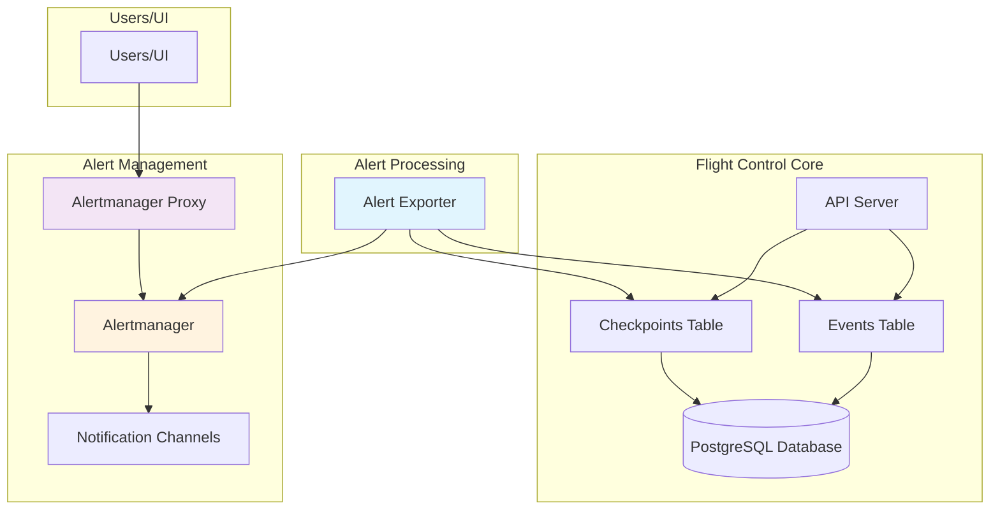
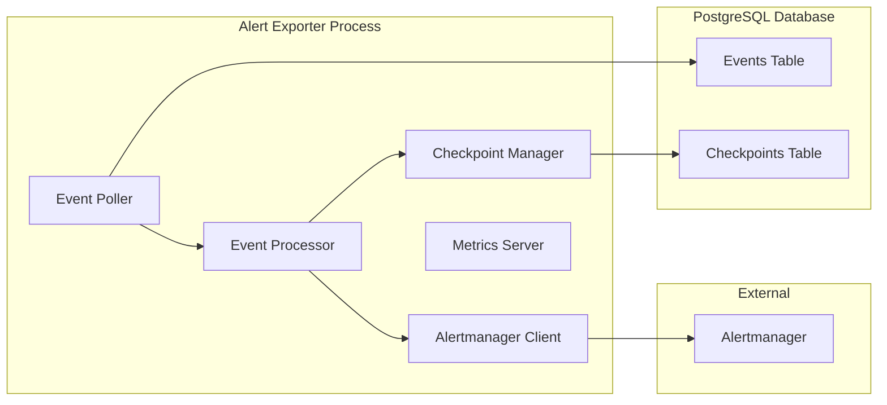
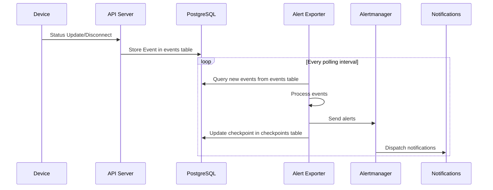

# Flight Control Alerts Architecture

This document describes the architecture of Flight Control's alerts system, including the alert exporter, Alertmanager integration, and authentication proxy.

## Overview

The Flight Control alerts system provides alerting for resource status changes. It processes events from the Flight Control PostgreSQL database and forwards them to Alertmanager for distribution and management.



## Components

### 1. Alert Exporter

- **Location**: `internal/alert_exporter/`
- **Binary**: `flightctl-alert-exporter`
- **Purpose**: Processes Flight Control events and converts them to Prometheus-compatible alerts

#### Architecture



#### Key Features

- **Event Processing**: Monitors Flight Control events (device disconnections, resource issues, etc.)
- **State Management**: Maintains checkpoint of processed events and active alerts in PostgreSQL
- **Retry Logic**: Exponential backoff retry mechanism for Alertmanager communication
- **Metrics**: Exposes Prometheus metrics on port 8081
- **Graceful Shutdown**: Handles SIGTERM/SIGINT signals properly

#### Event Types Processed

| Event Type | Alert Generated | Group |
|------------|----------------|-------|
| `DeviceDisconnected` | Device connectivity alert | - |
| `DeviceConnected` | Resolves connectivity alert | - |
| `DeviceApplicationError` | Application error alert | App Status |
| `DeviceApplicationDegraded` | Application degraded alert | App Status |
| `DeviceApplicationHealthy` | Resolves app status alerts | App Status |
| `DeviceCPUCritical` | CPU critical alert | CPU |
| `DeviceCPUWarning` | CPU warning alert | CPU |
| `DeviceCPUNormal` | Resolves CPU alerts | CPU |
| `DeviceMemoryCritical` | Memory critical alert | Memory |
| `DeviceMemoryWarning` | Memory warning alert | Memory |
| `DeviceMemoryNormal` | Resolves memory alerts | Memory |
| `DeviceDiskCritical` | Disk critical alert | Disk |
| `DeviceDiskWarning` | Disk warning alert | Disk |
| `DeviceDiskNormal` | Resolves disk alerts | Disk |
| `ResourceDeleted` | Resolves all alerts for resource | - |
| `DeviceDecommissioned` | Resolves all alerts for device | - |

### 2. Alertmanager Proxy

- **Location**: `internal/alertmanager_proxy/`
- **Binary**: `flightctl-alertmanager-proxy`
- **Purpose**: Provides authentication and authorization for Alertmanager access

#### Features

- **Authentication**: Validates Flight Control credentials
- **Authorization**: Enforces access controls
- **Proxy**: Forwards authenticated requests to Alertmanager
- **SSL/TLS**: Secure communication support

### 3. Alertmanager

- **Technology**: [Prometheus Alertmanager](https://prometheus.io/docs/alerting/latest/alertmanager/)
- **Purpose**: Alert routing, grouping, silencing, and notification delivery

#### Configuration

- **Routing**: Routes alerts based on labels (device, org, severity)
- **Grouping**: Groups related alerts to reduce noise
- **Inhibition**: Suppresses alerts based on rules
- **Silencing**: Temporary muting of alerts
- **Notifications**: Email, Slack, webhook integrations

## Data Flow

### Alert Creation Flow



### Checkpoint Management

The alert exporter maintains a checkpoint in the PostgreSQL checkpoints table to track:
- Last processed event timestamp
- Currently active alerts per resource
- Alert metadata (start time, resource info)

Note: The checkpoint only contains active alerts. Resolved alerts are removed from the checkpoint when they are resolved.

```json
{
  "version": 1,
  "timestamp": "2024-01-15T10:30:00Z",
  "alerts": {
    "org_id:device:device-name": {
      "DeviceDisconnected": {
        "resourceName": "device-name",
        "resourceKind": "Device",
        "orgID": "org_id",
        "reason": "DeviceDisconnected",
        "startsAt": "2024-01-15T10:25:00Z"
      }
    }
  }
}
```

## Configuration

### Alert Exporter Configuration

```yaml
alertmanager:
  hostname: "localhost"
  port: 9093
  maxRetries: 3
  baseDelay: "500ms"
  maxDelay: "10s"

service:
  alertPollingInterval: "1m"  # How often to check for new events
```

### Alertmanager Configuration Example

```yaml
global:
  smtp_smarthost: 'localhost:587'

route:
  group_by: ['org_id', 'resource']
  group_wait: 10s
  group_interval: 10s
  repeat_interval: 1h
  receiver: 'web.hook'

receivers:
- name: 'web.hook'
  webhook_configs:
  - url: 'http://webhook-server:5001/'
    send_resolved: true

inhibit_rules:
- source_match:
    severity: 'critical'
  target_match:
    severity: 'warning'
  equal: ['org_id', 'resource']
```

## Deployment

### Container Images

- `flightctl-alert-exporter`: Alert processing service
- `flightctl-alertmanager-proxy`: Authentication proxy
- `prom/alertmanager`: Standard Alertmanager

### Kubernetes/Helm Deployment

```yaml
# Alert Exporter
apiVersion: apps/v1
kind: Deployment
metadata:
  name: flightctl-alert-exporter
spec:
  replicas: 1  # Single instance due to checkpoint state
  template:
    spec:
      containers:
      - name: alert-exporter
        image: flightctl-alert-exporter:latest
        ports:
        - containerPort: 8081  # Metrics and health
        env:
        - name: CONFIG_PATH
          value: /etc/flightctl/config.yaml
```

### Podman/Quadlet Deployment

See `deploy/podman/flightctl-alert-exporter/` for Quadlet configurations.

## Data Storage

### PostgreSQL Database

**Events Table**: Stores all Flight Control system events
- Used by alert exporter to query new events since last checkpoint
- Filtered by event types relevant to alerting

**Checkpoints Table**: Stores alert exporter state
- Key: `alert-exporter:active-alerts`
- Contains JSON blob with active alerts and last processed timestamp
- Ensures processing continues from correct point after restarts

## Observability

### Metrics

The alert exporter exposes comprehensive metrics on port 8081:

- Processing performance and throughput
- Alert creation/resolution rates
- Alertmanager interaction success/failure
- Checkpoint operation metrics
- System health and uptime

See [metrics.md](../metrics.md) for complete metrics documentation.

### Logging

Structured logging with OpenTelemetry trace correlation for:
- Event processing pipeline
- Alert state changes
- Retry operations
- Error conditions

### Health Checks

- HTTP health endpoint at `/health` (port 8081 - container-internal)
- Metrics endpoint availability at `/metrics` (port 8081 - container-internal)
- Last successful processing timestamp tracking

**Note**: These endpoints are available on container port 8081 but are not exposed externally via Kubernetes Services. For external access, use `kubectl port-forward` or configure monitoring tools within the cluster.

## Security Considerations

### Authentication

- Alert exporter uses service account credentials
- Alertmanager proxy validates Flight Control tokens
- mTLS for inter-service communication

### Authorization

- Resource-level access controls
- Organization isolation
- Role-based alert management

### Network Security

- Internal network communication
- TLS encryption for external access
- Firewall rules for metric endpoints

## Scaling & Performance

### Alert Exporter

- **Single Instance**: Due to checkpoint state management in PostgreSQL
- **Polling Frequency**: Configurable (default: 1 minute)
- **Batch Processing**: Events processed in batches of 1000
- **Memory Usage**: Proportional to active alert count

### Alertmanager

- **High Availability**: Can run multiple replicas
- **Clustering**: Gossip protocol for state sharing
- **Storage**: Persistent volume for silence/notification state

## Troubleshooting

### Common Issues

1. **Missing Alerts**
   - Check event generation in PostgreSQL events table
   - Verify alert exporter processing logs
   - Confirm Alertmanager connectivity

2. **Duplicate Alerts**
   - Check checkpoint state consistency in PostgreSQL
   - Verify single alert exporter instance
   - Review event deduplication logic

3. **Performance Issues**
   - Monitor processing duration metrics
   - Check PostgreSQL query performance on events table
   - Review polling interval configuration

### Debugging

1. **Metrics**: Check processing and error rates using:
   ```bash
   # Port forward to access metrics locally
   kubectl port-forward deployment/flightctl-alert-exporter 8081:8081
   curl http://localhost:8081/metrics
   ```
2. **Logs**: Structured logging with OpenTelemetry trace correlation
3. **Database**: Query events and checkpoints tables directly
4. **Alertmanager**: Check alert reception and routing

## Future Enhancements

- **Multi-tenancy**: Enhanced organization isolation
- **Custom Alert Rules**: User-defined alerting conditions
- **Alert Correlation**: Cross-device alert relationships
- **Webhook Integration**: Custom notification channels