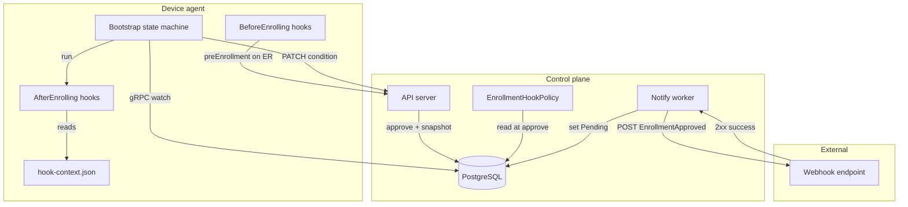
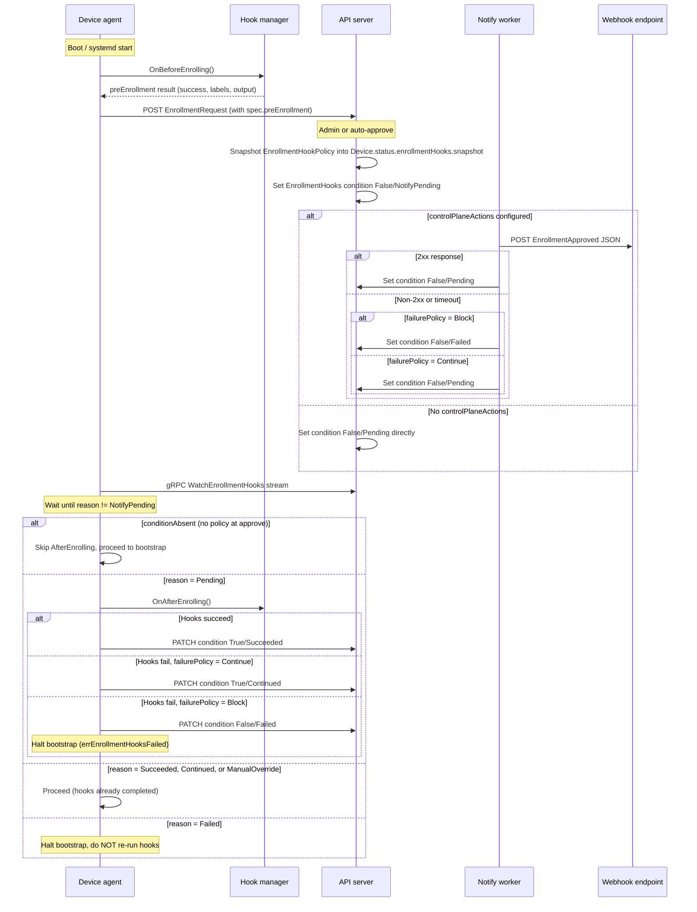

# Enrollment hooks

Enrollment hooks let integrators run custom logic at two points in the device enrollment lifecycle: before the enrollment request is submitted (BeforeEnrolling) and after enrollment is approved (AfterEnrolling). This document describes the architecture, agent state machine, configuration, and integration points grounded in the shipped 1.4 implementation.

## Overview

The enrollment hooks system spans four surfaces:

| Surface | Component | Purpose |
|---------|-----------|---------|
| Agent hooks.d YAML | `internal/agent/device/hook/manager.go` | Loads and executes HookAction rules from on-device YAML files |
| Agent bootstrap state machine | `internal/agent/device/bootstrap.go` | Orchestrates the EnrollmentHooks condition lifecycle during boot |
| Control-plane notify worker | `internal/tasks/enrollment_hook_notify.go` | Delivers EnrollmentApproved webhooks to external systems |
| EnrollmentHookPolicy API | `api/core/v1beta1/openapi.yaml` | Org-scoped resource defining failure policy and control-plane actions |



## Device lifecycle and hook execution points

BeforeEnrolling and AfterEnrolling are agent-local hook types defined as `DeviceLifecycleHookType` values in the API. They run at distinct points in the bootstrap sequence.



### Key branch behaviors

- **conditionAbsent**: No EnrollmentHookPolicy existed when enrollment was approved. The agent skips AfterEnrolling entirely and proceeds to normal bootstrap. This diverges from the design document, which stated that image-shipped hooks would still run.
- **Failed + restart**: When the agent restarts and finds the condition in Failed state, it halts immediately without re-running hooks. A ManualOverride is required to proceed. This diverges from the design document, which stated that restart would re-run hooks from the start.

## Snapshot model and condition reporting

### Snapshot

At enrollment approval, the server writes an immutable snapshot of the active EnrollmentHookPolicy into `Device.status.enrollmentHooks.snapshot`. The snapshot contains:

- `failurePolicy` (Block or Continue)
- `controlPlaneActions` (non-secret copies of HTTP action configs; `bearerToken` is excluded from GET responses)

The snapshot is written once at approve time and is not updated if the policy changes later. This ensures that all devices approved under a given policy version execute the same hook configuration.

### EnrollmentHooks condition

The `EnrollmentHooks` condition on the Device tracks hook execution state. It uses six defined reasons:

| Status | Reason | Meaning |
|--------|--------|---------|
| False | NotifyPending | Approval complete; waiting for notify worker to deliver webhooks |
| False | Pending | Notify succeeded (or none configured); waiting for agent to run AfterEnrolling |
| False | Failed | Hooks or notify failed with Block policy; device is gated |
| True | Succeeded | AfterEnrolling hooks ran and passed |
| True | Continued | AfterEnrolling hooks failed but failurePolicy was Continue |
| True | ManualOverride | An operator used the override API to clear a Failed state |

While the condition is False, the device is excluded from fleet matching and does not receive rendered specifications.

### gRPC watch

The agent uses a gRPC streaming watch (`WatchEnrollmentHooks`) to learn when the condition leaves NotifyPending, rather than polling. If the stream breaks, the agent reconnects with exponential backoff (initial 5s, factor 2, cap 5 min, up to 10 steps). This backoff is defined in `defaultEnrollmentHooksBackoff` in `bootstrap.go`.

### Default failure policy

When `failurePolicy` is empty or unset, the agent defaults to Block:

```go
if failurePolicy == "" {
    failurePolicy = v1beta1.FailurePolicyBlock
}
```

## Agent configuration reference

The agent exposes a single enrollment-related configuration field in `/etc/flightctl/config.yaml`:

```yaml
enrollment:
  preEnrollment:
    failurePolicy: Continue  # or Block
```

| Field | Type | Default | Description |
|-------|------|---------|-------------|
| `enrollment.preEnrollment.failurePolicy` | string | `Continue` | Controls behavior when BeforeEnrolling hooks fail. `Continue` submits the enrollment request with `preEnrollment.success=false`. `Block` retries hooks with backoff and never submits the enrollment request until hooks succeed. |

There is no global timeout field for post-enrollment hooks. Per-action timeouts are set on individual HookAction rules in the hooks.d YAML files using the existing `timeout` field from the lifecycle hooks framework.

## Integrator guidance

### hooks.d YAML layout

Hook files are YAML HookAction rule lists (not executable scripts). They follow the same format as lifecycle hooks (BeforeUpdating, AfterUpdating, and similar). The agent loads files matching `*.yaml` from the hooks.d subdirectory named after the hook type (lowercased).

**BeforeEnrolling** loads from two directories with overlay semantics (later directories override files with the same name):

1. `/usr/lib/flightctl/hooks.d/beforeenrolling/` (image-shipped, read-only)
2. `/etc/flightctl/hooks.d/beforeenrolling/` (user-writable overlay)

**AfterEnrolling** loads from a single directory:

1. `/usr/lib/flightctl/hooks.d/afterenrolling/` (image-shipped only; no `/etc` overlay in 1.4)

Files within each directory are sorted lexically and executed in order. Each YAML file contains a list of HookAction objects with `run:` actions:

```yaml
# /usr/lib/flightctl/hooks.d/afterenrolling/10-setup.yaml
- run: /usr/local/bin/configure-vpn.sh
  timeout: 60s
  if:
    - "{{ .hookContext.labels.region }}"
```

### hook-context.json

Before running enrollment hooks, the hook manager writes a JSON context file to `/run/flightctl/hook-context.json` (mode 0600). The same JSON is also injected as the `FLIGHTCTL_HOOK_CONTEXT` environment variable.

The context includes:

```json
{
  "hook": "AfterEnrolling",
  "deviceName": "device-abc123",
  "systemInfo": { "hostname": "edge-01", "architecture": "amd64" },
  "labels": { "region": "us-east" },
  "managementCertificate": {
    "serialNumber": "46:E5:42:26:2B:79:34:F2",
    "notAfter": "2027-09-06T00:00:00Z",
    "sha256": "a1b2c3..."
  }
}
```

The `managementCertificate` field contains metadata only (serial number, expiry, SHA-256 fingerprint). No private key material is included. Scripts that need secrets from a vault or secret store must call those services directly.

### Hook labels

BeforeEnrolling hooks can write a JSON object to `/run/flightctl/hook-labels.json` (max 16 KiB). The agent reads this file after hook execution and includes the labels in the enrollment request. This allows hooks to dynamically set device labels based on hardware or environment discovery.

### Idempotency

AfterEnrolling hooks should be idempotent. The agent runs them exactly once under normal operation, but if the PATCH that reports Succeeded fails and the agent restarts, hooks will not re-run (the Failed state halts bootstrap). Design hooks so that partial completion does not leave the device in a broken state.

### EnrollmentHookPolicy resource

The `EnrollmentHookPolicy` is an org-scoped v1beta1 API resource that defines the server-side behavior for enrollment hooks:

```yaml
apiVersion: flightctl.io/v1beta1
kind: EnrollmentHookPolicy
metadata:
  name: default
spec:
  afterEnrolling:
    failurePolicy: Block
    controlPlaneActions:
      - url: https://hooks.example.com/notify
        timeout: 30s
        retry:
          maxAttempts: 3
          backoffPolicy: exponential
          backoffDelay: 5s
          maxBackoff: 2m
          deadline: 10m
        auth:
          bearerToken: "<secret>"
```

**Control-plane actions** are HTTP webhooks executed by the notify worker after enrollment approval. Each action POSTs an `EnrollmentApproved` JSON payload:

```json
{
  "apiVersion": "v1beta1",
  "kind": "EnrollmentApproved",
  "deviceName": "device-abc123",
  "labels": { "region": "us-east" },
  "certificateSerial": "46:E5:42:26:2B:79:34:F2"
}
```

Each request includes the headers `X-Flightctl-Delivery-Id` and `X-Flightctl-Delivery-Attempt` for idempotency tracking. The webhook endpoint must return a 2xx status code to indicate success.

**Retry policy fields:**

| Field | Type | Default | Range | Description |
|-------|------|---------|-------|-------------|
| `maxAttempts` | integer | 5 | 1-20 | Maximum number of delivery attempts |
| `backoffPolicy` | string | `exponential` | - | Backoff strategy |
| `backoffDelay` | string | `2s` | - | Initial backoff delay |
| `maxBackoff` | string | `2m` | - | Maximum backoff duration |
| `deadline` | string | `10m` | - | Overall deadline for all retry attempts |

## Failure handling

The following matrix summarizes failure outcomes across the two failure surfaces:

| Failure point | failurePolicy = Block | failurePolicy = Continue |
|---------------|----------------------|--------------------------|
| Notify worker cannot reach webhook | Condition set to Failed; agent does not run AfterEnrolling | Condition set to Pending; agent runs AfterEnrolling |
| AfterEnrolling hooks fail on device | Condition set to Failed; bootstrap halts | Condition set to Continued (True); bootstrap proceeds |
| Agent restarts with Failed condition | Bootstrap halts immediately; hooks do not re-run | N/A (Continue never reaches Failed on the agent side) |

### ManualOverride

When a device is stuck in Failed state, an authorized administrator or operator can clear the gate:

```
POST /api/v1/devices/<device_name>/enrollmenthooks/override
```

This sets the EnrollmentHooks condition to True with reason ManualOverride. The override does not re-approve enrollment, rotate the device management certificate, or rerun the notify webhook.

**RBAC**: Only admin and operator roles can perform this action. The installer role cannot override.

The `EnrollmentHooks` condition is service-owned. A generic device-status PATCH cannot change or remove it.

For user-facing instructions, see [Overriding a failed enrollment hook](../../user/using/managing-devices.md#overriding-a-failed-enrollment-hook).

## Upgrade considerations

Enrollment hooks require agent version 1.4 or later. When deploying enrollment hook policies to an environment with mixed agent versions:

1. **Upgrade agents first.** Ensure all agents in the target fleet are running 1.4+ before applying an EnrollmentHookPolicy.
2. **Condition gating.** When a policy exists at approve time, the server always sets `EnrollmentHooks=False` on the Device. Pre-1.4 agents do not know how to PATCH this condition to True, which means the device remains excluded from fleet matching indefinitely.
3. **Even Continue requires 1.4.** The failurePolicy:Continue setting still requires a 1.4+ agent to transition the condition to True/Continued or True/Succeeded.

## Deferred features

The following features are described in the design document but are not yet implemented:

- **deviceActions**: Server-delivered HookAction YAML lists snapshotted at approve time, enabling the control plane to push hook definitions to devices without baking them into the OS image.
- **Webhook file responses**: Webhook endpoints returning files that are delivered to the device as part of the enrollment response.
- **Key-value EnrollmentHookPayload**: A structured data exchange mechanism between hooks and the enrollment pipeline.
- **CLI retry command**: A `flightctl retry enrollmenthooks` CLI subcommand for re-triggering failed hooks without a full ManualOverride.

## Related resources

- [Design document: enrollment hooks](https://github.com/flightctl/design-docs) (upstream design-docs repository)
- [OpenAPI specification](../../api/core/v1beta1/openapi.yaml) (EnrollmentHookPolicy, EnrollmentHookSnapshot, DeviceEnrollmentHooksStatus schemas)
- [Managing devices: overriding a failed enrollment hook](../../user/using/managing-devices.md#overriding-a-failed-enrollment-hook) (user guide)
- [Agent lifecycle hooks](../../../internal/agent/device/hook/manager.go) (source: hook manager implementation)
- [Agent bootstrap state machine](../../../internal/agent/device/bootstrap.go) (source: ensurePostEnrollmentHooks)
