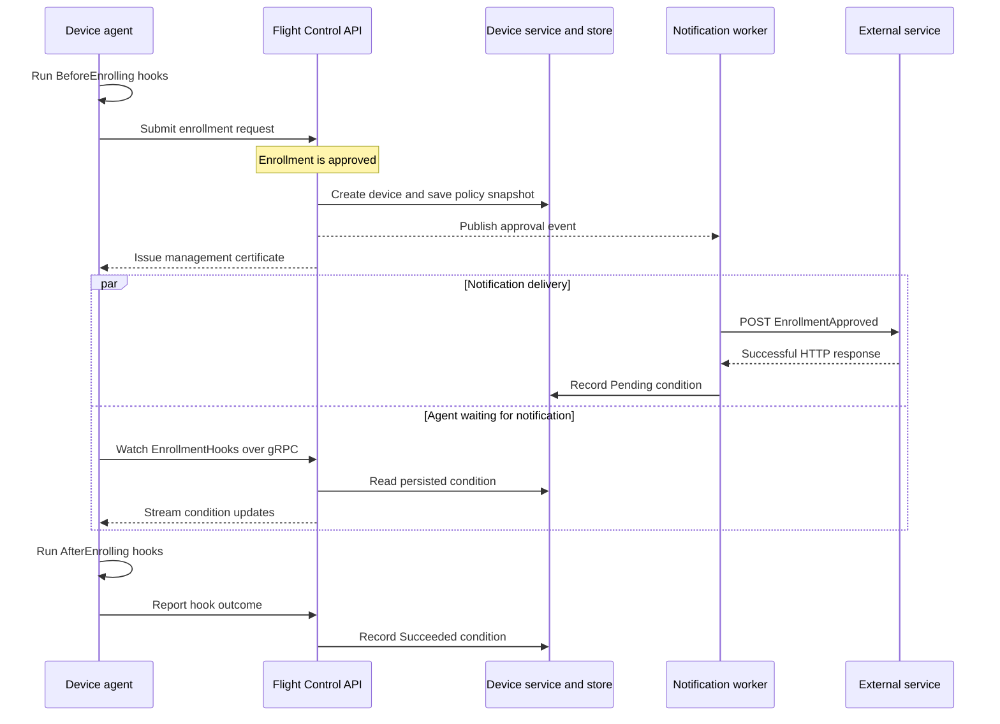

# Enrollment hook architecture

Enrollment hooks connect device enrollment to local preparation and external services. The agent runs commands on the device, while the control plane approves enrollment, delivers optional notifications, and controls when device management can begin.

This page describes those responsibilities and the integration contracts. For configuration examples and recovery procedures, see [Using enrollment hooks](../../user/using/enrollment-hooks.md).

## Responsibilities across the device lifecycle

Enrollment runs during agent bootstrap. Once enrollment hooks allow bootstrap to finish, the agent starts ordinary device reconciliation. Update and reboot hooks run as part of that later lifecycle.

| Stage | Agent responsibility | Control-plane responsibility |
|-------|----------------------|------------------------------|
| Bootstrap | Initialize local state and establish the device's management identity | Provide enrollment and management APIs |
| Enrollment | Run `BeforeEnrolling`, submit the request, store the issued certificate, and run `AfterEnrolling` when allowed | Approve the request, create the device, save its hook policy settings, and deliver optional notifications |
| Update | Apply the desired specification, including bootc image updates, with `BeforeUpdating` and `AfterUpdating` hooks | Select devices for rollout and render their desired specifications |
| Reboot | Run `BeforeRebooting`, request the reboot, and run `AfterRebooting` when startup detects a reboot | Retain desired state and receive the agent's progress reports |

The enrollment gate takes effect after approval and certificate issuance. It delays fleet matching and configuration delivery until notification and device-hook processing permit management to start.

## Approval and notification sequence

The following sequence shows successful enrollment with a policy that includes a webhook. Notification delivery and the agent's connection can happen concurrently.

The API server authenticates the agent's watch and reads the device condition through the device service. Persisted state determines readiness; a dropped connection can reconnect and read the current condition.

Without webhook actions, approval sets the condition to `Pending` immediately. Without a policy, approval creates no enrollment-hook condition, and the agent skips `AfterEnrolling` hooks.

## Policy snapshot and readiness condition

Each organization has at most one `EnrollmentHookPolicy`, named `default`. Approval copies its failure policy and notification action settings into `status.enrollmentHooks.snapshot` on the device. The worker and agent use these saved settings for that enrollment.

Editing or deleting the policy affects future approvals. It does not change an existing snapshot or install device commands. Notification bearer tokens are stored separately from the device snapshot and are not included in the webhook payload.

The `EnrollmentHooks` condition coordinates the control plane and agent:

| Reason | Status | Responsibility and meaning |
|--------|--------|----------------------------|
| `NotifyPending` | `False` | Approval has queued notifications; the worker has not completed them |
| `Pending` | `False` | The agent can run local hooks; notification succeeded, was absent, or failed under `Continue` |
| `Failed` | `False` | The worker or agent recorded a failure under `Block`; management remains gated |
| `Succeeded` | `True` | The agent completed local hooks successfully |
| `Continued` | `True` | Local hooks failed and the saved policy allowed continuation |
| `ManualOverride` | `True` | An authorized operator cleared a recorded failure through the override endpoint |

Fleet matching and rendered specification delivery remain gated while this condition is `False`. The agent may report `Pending` to `Succeeded`, `Continued`, or `Failed` through a device-status patch. Arbitrary condition changes and removal are rejected; recovery uses the dedicated override endpoint.

## Contracts for image and service integrators

`BeforeEnrolling` reads image rules from `/usr/lib/flightctl/hooks.d/beforeenrolling/`, with same-name overrides from `/etc/flightctl/hooks.d/beforeenrolling/`. `AfterEnrolling` reads only `/usr/lib/flightctl/hooks.d/afterenrolling/`. Include the commands, dependencies, and rules in the initial bootc image so they are available before managed configuration arrives.

The agent setting `enrollment.preEnrollment.failurePolicy` in `/etc/flightctl/config.yaml` defaults to `Continue`: a failed local hook does not prevent request submission. `Block` prevents submission and retries the hook with backoff. After approval, the saved policy governs both notification and local-hook failures, with `Block` as the default.

Notifications tell external services about approval. The worker does not return service credentials to the device. Device scripts obtain any required secrets through the integrator's own service. Keep credentials out of command output. The agent records it in `spec.preEnrollment.actions[].output` on the enrollment request.

Local hooks and webhook receivers must tolerate repeated execution. A restart before the hook result is recorded can leave `Pending` and run local hooks again. Recorded `Succeeded`, `Continued`, and `ManualOverride` results skip local hooks; a recorded `Failed` result remains blocked and does not rerun them. Webhook receivers use the delivery ID to avoid processing the same action more than once.

Deploy version 1.4 or later agents throughout the organization before applying `EnrollmentHookPolicy/default`, including a policy using `Continue`. Approval initially gates every device covered by the policy; older agents cannot report the outcome needed to clear that gate.

For rule examples, retry configuration, context data, and recovery, see [Using enrollment hooks](../../user/using/enrollment-hooks.md). For resource fields and constraints, see the [OpenAPI schema](../../../api/core/v1beta1/openapi.yaml).
