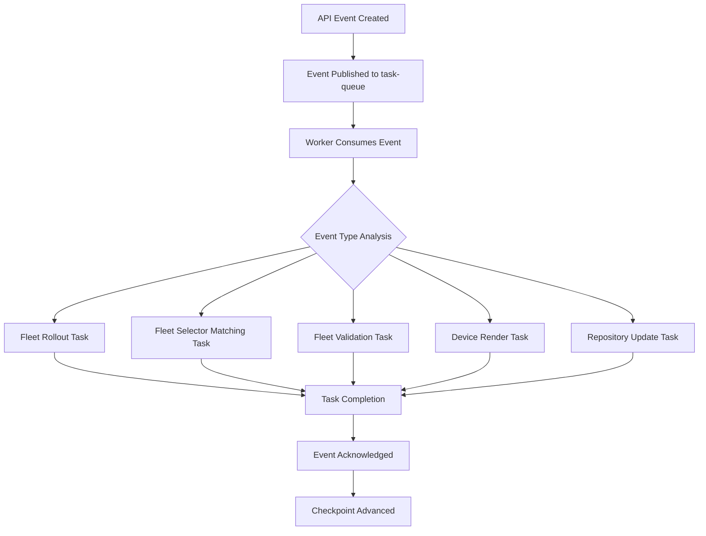

# Key-Value Store Architecture

Flight Control uses Redis as a key-value store for two primary purposes: **caching external configuration data** and **managing an event-driven task queue**. This document describes both use cases and the resilience mechanisms that ensure system reliability.

## Overview

The key-value store serves as:
1. **Cache Layer**: Stores external configuration data (Git repositories, HTTP endpoints, Kubernetes secrets)
2. **Event Queue**: Manages asynchronous task processing through Redis Streams
3. **Resilience Backend**: Provides automatic recovery from failures

## Caching External Configuration Data

Flight Control caches external configuration sources to improve performance and reduce load on external systems. The cache is organized by organization, fleet, and template version to ensure proper isolation.

### Cached Data Types

| Data Type | Key Pattern | Description |
|-----------|-------------|-------------|
| **Git Repository URLs** | `v1/{orgId}/{fleet}/{templateVersion}/repo-url/{repository}` | Repository URL mappings |
| **Git Revisions** | `v1/{orgId}/{fleet}/{templateVersion}/git-hash/{repository}/{targetRevision}` | Git commit hashes for specific revisions |
| **Git File Contents** | `v1/{orgId}/{fleet}/{templateVersion}/git-data/{repository}/{targetRevision}/{path}` | Actual file contents from Git repositories |
| **Kubernetes Secrets** | `v1/{orgId}/{fleet}/{templateVersion}/k8ssecret-data/{namespace}/{name}` | Secret data from Kubernetes clusters |
| **HTTP Response Data** | `v1/{orgId}/{fleet}/{templateVersion}/http-data/{md5(url)}` | Content fetched from HTTP endpoints |

### Cache Behavior

- **Cache Keys**: Automatically scoped by organization, fleet, and template version
- **Cache Invalidation**: Keys are deleted when template versions change
- **Cache Miss Handling**: External sources are fetched on-demand when cache misses occur
- **Atomic Operations**: Uses a custom Lua script to implement get-or-set-if-not-exists behavior, preventing race conditions during concurrent access

### Important Cache Considerations

⚠️ **Cache Consistency Warning**: When external configuration sources change without updating their references (branch/tag/URL), devices may experience configuration drift:

- **Before cache deletion**: Some devices get `value1` from cache
- **After cache deletion**: Other devices get `value2` from fresh fetch
- **Result**: Inconsistent device configurations across the fleet

**Best Practice**: Always update branch names, tags, or URLs when changing external configuration content to ensure cache consistency.

## Event-Driven Task Queue

Flight Control uses Redis Streams with consumer groups to process events asynchronously. Events are published to the `task-queue` stream and processed by worker components.

### Event Processing Flow

### Event-to-Task Mapping

| Task | Triggering Events | Description |
|------|------------------|-------------|
| **Fleet Rollout** | • Device owner/labels updated • Device created • Fleet rollout batch dispatched • Fleet rollout started (immediate strategy) | Manages device configuration updates according to fleet templates |
| **Fleet Selector Matching** | • Fleet label selector updated • Fleet created/deleted • Device created • Device labels updated | Matches devices to fleets based on label selectors |
| **Fleet Validation** | • Fleet template updated • Fleet created • Referenced repository updated | Validates fleet templates and creates template versions |
| **Device Render** | • Device spec updated • Device created • Fleet rollout device selected • Referenced repository updated | Renders device configurations from templates |
| **Repository Update** | • Repository spec updated • Repository created | Updates repository references and invalidates related caches |

### Queue Management Features

- **Consumer Groups**: Automatic message tracking and load balancing
- **Message Acknowledgment**: Messages are acknowledged after successful processing
- **Timeout Handling**: Messages that exceed processing timeout are automatically retried
- **Failed Message Handling**: Failures are retried with exponential backoff until a maximum number of retries, after which an event is emitted notifying about a permanent failure
- **Checkpoint Tracking**: Global checkpoint ensures no message loss during failures

## Resilience and Recovery

Flight Control implements a **dual-persistence architecture** to ensure no event loss during Redis failures (at-least-once delivery; duplicate processing possible):

### Architecture Components

1. **Redis Streams**: Primary queue for fast event processing
2. **PostgreSQL Database**: Persistent storage for events and checkpoints
3. **Recovery Mechanism**: Automatic event republishing from database

### Recovery Process

When Redis fails or is restarted:

1. **Checkpoint Detection**: System detects missing Redis checkpoint
2. **Database Checkpoint Retrieval**: Last known checkpoint is retrieved from PostgreSQL
3. **Event Republishing**: All events since the last checkpoint are republished to Redis
4. **Queue Restoration**: Fresh Redis instance receives all missed events
5. **Normal Operation**: Processing resumes; events since the checkpoint may be reprocessed. Handlers must be idempotent.

Note: The replay window equals “now - last persisted checkpoint”. Increase checkpoint persistence frequency to shorten replay/duplication.

### Recovery Limitations

⚠️ **Important**: The resilience mechanism only replays **events in the queue**. It does not restore cached external configuration data:

- **Events**: Automatically republished from PostgreSQL database
- **Cache Data**: Must be re-fetched from external sources (Git, HTTP, Kubernetes)
- **Cache Invalidation**: Occurs automatically when template versions change