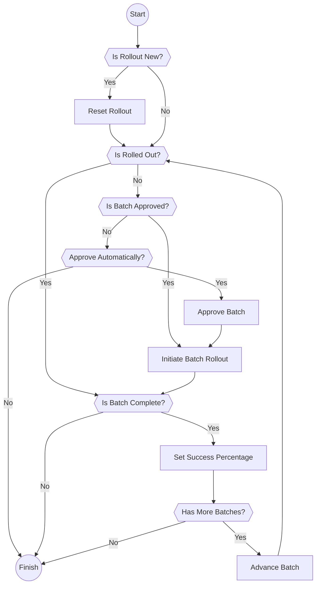

# Rollout device selection
The rollout device selection is implemented as periodic reconciler that is invoked by the periodic server.

The rollout device selection enables controlled, batch-based updates across device fleets. It works in conjunction with
the disruption budget to ensure safe and manageable rollouts.

Prerequisites:
- Fleet must have a defined rollout policy with device selection criteria
- Devices must be identified as out-of-date compared to the fleet's device specification

The reconciler processes fleets that meet these criteria and manages the progression of updates through defined batches.

The following chart describes a fleet reconcile flow:

