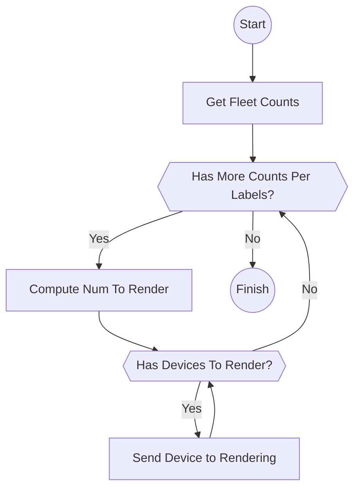

# Disruption Budget
The disruption budget is implemented as a periodic reconciler that is invoked by the periodic server.

All relevant fleets are reconciled using the following process:
1. A special query (count by labels) determines how many devices need to be rendered for each label key
2. Based on the disruption budget policy, a subset of devices is selected for rendering
3. Selected devices are sent for rendering while staying within budget constraints

The following chart describes the high-level flow of fleet reconciliation by the disruption budget reconciler:
