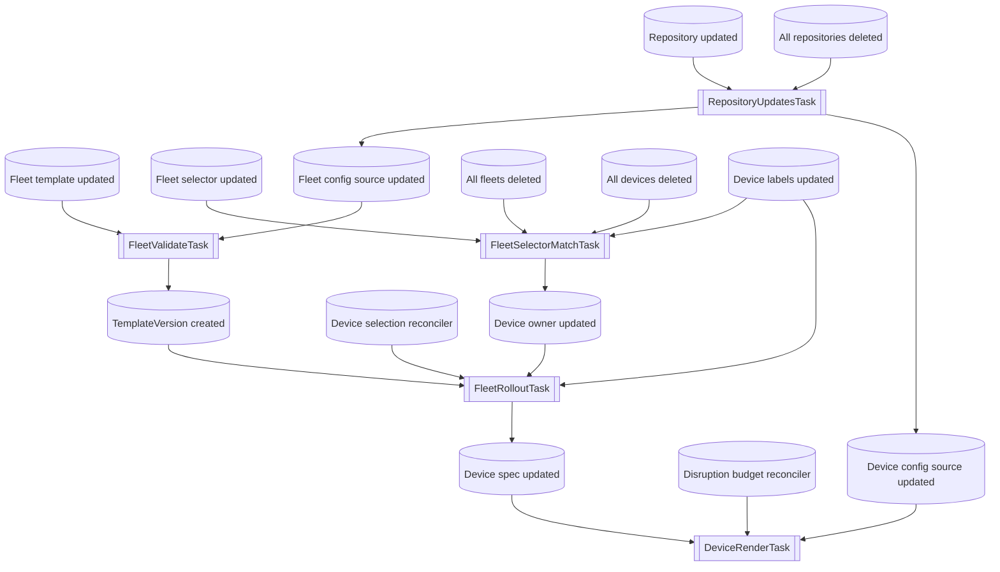

# Asynchronous tasks in the service

The service aims to perform the minimum amount of work in the synchronous part of API calls, and offload work to asynchronous tasks.

There are two types of tasks: event-based and periodic.

## Event-based tasks

Tasks must be idempotent and not rely on ordering so that they can be delivered and retried without any race conditions.
Tasks must be independent to avoid deadlocks.

This flow chart depicts the tasks that each update to the store can trigger, and what store updates each task can trigger.

## Periodic tasks

1. Try to access each repository and update its Status.
2. Check if each ResourceSync is up-to-date, and update resources if necessary.
3. Perform device selection for fleet rollout according to the batches defined in the rollout policy
4. Send devices to rendering according to the disruption budget defined in the rollout policy
