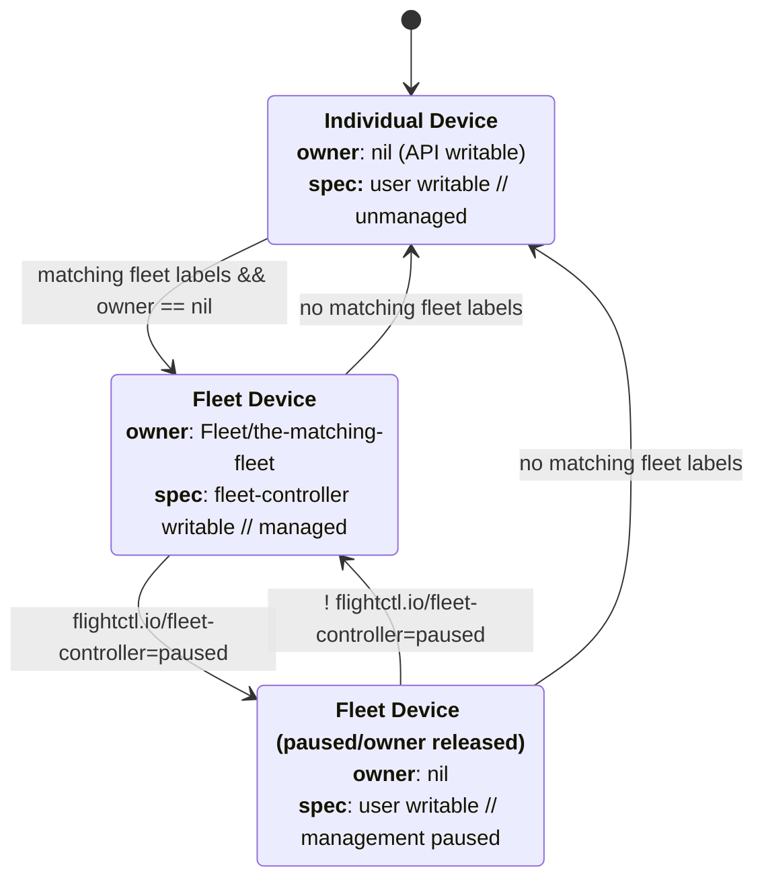

# EP: Definition of the Fleet and Device API spec
<!-- this format is inspired by the K8S KEP format https://raw.githubusercontent.com/kubernetes/enhancements/master/keps/NNNN-kep-template/README.md -->
## Summary

The Device API, and Fleet API, and the dynamics of managing individual
devices as well as fleets of devices is a fundamental piece of flightctl.

The Fleet API must serve as a way to manage groups of devices while still allowing
for the management of individual devices in a way that we can integrate with other
management systems.

During this RFE two logical controllers are mentioned: `device-controller` and
`fleet-controller`, those are the logical pieces of our code-base in charge of maintaining
the device rendered spec, and the device spec in relation to a fleet. Those controllers
are not separate microservices, and this RFE does not mandate or request that.

## Motivation

We need agreement on the API design direction and the semantics of the API to be able to
implement and grow the flightctl service.

### Goals

* Define the format and behavior of the Device and Fleet APIs

* Allow the management of individual fleetless devices on a smaller scale
  as an integration mechanism for services like AAP and ACM.

* Allow the management of fleets of devices on a larger scale, via gitops or API.

* Change API fields to provide a more consistent experience.

* Enable temporary/manual drift of fleet-managed devices for debug purposes.

### Non-Goals


## Proposal

### General

All resources containing ObjectMeta will include a `resourceVersion` field, this field is
an opaque string that is updated on every change to the resource, it can be used for
opportunistic concurrency control.

### Device API

The device API is divided into multiple methods, some user-facing, and other device-facing,
this design facilitates cleaner RBAC control of the endpoint access. The diagram is only
intended to illustrate the flow of information between the user/system and the device.

```mermaid
block-beta
columns 1
  user(["User"])

  space


  block
    frontEndpoint["/devices/{name}"]
  end

  user --> frontEndpoint
  frontEndpoint --> user

  space
  block
    metadata
    devSpec["spec"]
    devStatus["status"]
  end

  space

  frontEndpoint --> metadata
  frontEndpoint --> devSpec
  frontEndpoint --> devStatus

  block
     renderedEndpoint["/devices/{name}/rendered"]
     statusEndpoint["/devices/{name}/status"]
  end

  space

  statusEndpoint --> devStatus
  statusEndpoint --> devStatus
  devSpec --> renderedEndpoint
  renderedEndpoint --> Device
  Device --> statusEndpoint


  Device(["Device"])

  style frontEndpoint fill:#969,stroke:#333,stroke-width:4px
  style renderedEndpoint fill:#969,stroke:#333,stroke-width:4px
  style statusEndpoint fill:#969,stroke:#333,stroke-width:4px
  ```

#### `/devices/{name}` User facing method

This endpoint can be accessed by the user or external systems to
manage individual devices, also internally from the fleet specifications
for devices.

The proposed changes include:

* Reincorporating device.spec as a visible part through this frontend API.

* The `device.spec.os.image` contains a reference to the image to be used for the device.

* The `device.spec.templateVersion` is removed. An annotation will be used to track the latest template applied to the
  device. (See the fleet API section for more details)

* The `device.spec.{containers, systemd}` fields are moved under `device.spec.monitoring.{containers, systemd}`

* The `device.spec.monitoring.containers` contains a list of container patterns to be watched on the device (as in the fleet spec)

* The `device.spec.monitoring.systemd` contains a list of systemd service patterns to be watched on the device (as in the fleet spec)

* The `device.spec.config` contains a list of zero or more config items.

* The config items could be inline definition of config files (`InlineConfigProviderSpec`)

* Some config items reference external configurations (`KubernetesSecretProviderSpec`, `GitConfigProviderSpec`)

* External references (image or config items) must support floating tags (`latest`, `main`, `v1.0`), although
  **when managed from a fleet, the floating tags will be frozen as hashes** on the device spec by the
  fleet controller.

* Some external items are actually non-versioned like the K8s secrets, so are inherently floating.

* The `device.status.conditions` field can be extended by the `device-controller` to provide
  additional conditions related to management of the device related to the spec rendering (i.e.
  A source referenced on the spec cannot be found, a reference is not accessible, pre-flight checks
  related to an os-image aren't passing, etc..)
  No other fields on the status or agent-related conditions could be written by the `device-controller`.


Complete representation of the proposed device:

```yaml
apiVersion: flightctl.io/v1alpha1
kind: Device
metadata:
  name: fab9839018890a88b898b980f8f809f8e8ac333761977d987a777a777a987ccce
  labels:
    site: factory-a
    deviceType: optical-inspector
    stage: production
  annotations:
    fleet-controller/templateVersion: "optical-inspector-production-fleet-0000001" # the fleet controller uses this annotation to track the latest template applied
  owner: Fleet/optical-inspector-production-fleet
  resourceVersion: "somehash" # provides opportunistic concurrency control
spec:
  os:
    image: quay.io/redhat/rhde:9.2
  config:
    - name: rendered-config
      configType: InlineConfigProviderSpec
      inline:
        ignition:
          version: 3.4.0
        storage:
          files:
            - contents:
                source: >-
                  data:,This%20system%20is%20managed%20by%20flightctl.%0A
              mode: 422
              overwrite: true
              path: "/etc/motd"

    - name: config-from-git
      configType: GitConfigProviderSpec
      repository: my-repo
      ref: v1.0.0
      path: /path/to/config/in/git

    - name: config-from-k8s-secret
      configType: KubernetesSecretProviderSpec
      name: my-secret
      namespace: my-namespace
      mountPath: /path/to/config/in/device

  monitoring:
    containers:
      matchPatterns:
        - *my-container*
        - *another-container*

    systemd:
      matchPatterns:
        - chronyd.service
        - firewalld.service
        - sshd*.service

status:
  conditions: # NOTE: The conditions will probably need a full definition/documentation/possible adjustments
  - lastTransitionTime: "2024-04-30T15:06:20Z"
    message: All is good
    reason: AsExpected
    status: "False"
    type: Progressing
  - lastTransitionTime: "2024-04-30T15:06:19Z"
    message: All is good
    reason: AsExpected
    status: "True"
    type: Available
  containers:
    - id: fa31890ae222449abb00ff90ed801674
      name: my-container
      status: running
      image: quay.io/myorg/myimage:v1.0.0
      engine: podman
  systemdUnits:
    - name: chronyd.service
      loadState: running     #Q: those fields need clatification, not obvious what they mean
      activeState: active
    - name: sshd.service
      loadState: running
      activeState: active
  systemInfo: # The systemInfo field will likely change in future RFEs, i.e. measurements will probably
              # go away or change format (to provide specific quotes for specific PCRs)
    architecture: arm64
    bootID: 87f7e27e-bdc0-42b1-b909-6dc81fe43ea2
    machineID: fa31890ae222449abb00ff90ed801674
    measurements:
      pcr01: "0000000000000000000000000000000000000000000000000000000000000000"
      ...
      pcr16: "0000000000000000000000000000000000000000000000000000000000000000"
    operatingSystem: linux
  updatedAt: "2024-04-30T15:06:19Z"
```

##### Device state regarding fleet managment
This diagram illustrates what the following sections describe in text.


##### `/devices/{name}` with no owner fleet (Individual Device)

Devices with no matching labels to a fleet are manually managed and start with no `metadata.owner`
reference; the fleet controller will not attempt to reconcile or configure the device in any way.

Ownership of a device can be claimed through the API by setting the `metadata.owner` field to
`{owner}/{additional data}`, i.e. the fleet-controller can claim a device by setting
`Fleet/fleet-name`. 

`metadata.owner` is a protected field, specific owners can only be set through the API
with specific authentication, i.e. we could use a specific attribute of the X.509 TLS
certificate to contain the owner identity, or be passed as a header from the API gateway.
This means that the fleet-controller is the only one being able to claim a device to Fleet/
or to release a device claimed by a fleet.

External controllers dealing with devices can only set the `metadata.owner` field
to the authentication-allowed {owner} namespace.

If a fleet matches this device, and the device has empty `metadata.owner` the fleet controller
will claim the device, by setting `metadata.owner` to `Fleet/{fleet-name}`.

If a fleet stops matching a device or if the fleet controller is paused on a device,
`metadata.owner` is cleared by the fleet controller, and the device becomes manually managed.

The `os.image` and configuration fields in this API support floating tags, and while the fleet manager
does freeze the tags to hashes, the user is free to setup the device spec with floating references.

Every time the device is updated in any way, the `metadata.resourceVersion` field is updated.

Every time the device spec changes, the device controller will generate a new device rendered
configuration, and update the `metadata.annotation['renderedVersion']` field.

###### Expected behavior regarding external references with floating tags

Changes on external references are monitored and acted on (git branches,
device images, secrets), the device controller should re-evaluate the device
spec and apply the changes to the rendered version which will be exposed
on the `/devices/{name}/rendered` endpoint.

Every time the rendered output changes due to changes on
external references, the `metadata.annotation['renderedVersion']` is updated
this detail is exposed via the `/devices/{name}/rendered` endpoint. `renderedVersion`
is monotonically increasing and can be used to track changes to the device spec,
as well as easily understood by a human observer.

Several mechanisms can be used to track external references:
* Polling
* Webhooks

##### `/devices/{name}` while managed by a fleet (Fleet Device)

When managing a device through a fleet, flightctl is responsible
for maintaining the device spec in sync with the fleet spec; in this case
*write access is only possible for the modification of labels and other metadata*
through this API except for the owner fleet.

> [!NOTE]
> Devices managed by a fleet have their floating tags resolved to stable hashes at this API
> level. This is done to ensure that the device is always in sync with the fleet spec.

The device will have an owner reference to the managing fleet, i.e.:

```yaml
  owner: Fleet/optical-inspector-production-fleet
```

#### `/devices/{name}/rendered` (device and user read-only)
This endpoint is used by the device agent to retrieve the rendered device spec, this endpoint is
read-only, each device can only access it's own device rendered spec based on the device
certificate identification, a user with admin privileges can access any device rendered spec
for debug purposes.

The agent can pass: `knownRenderedVersion`, this is compared to the `renderedVersion` device
annotation, if this opaque field has not changed the API will return
204 No Content, if the field has changed, the API will return the rendered spec.

Change proposed:
* The parameter name `knownOwner` is removed.
* The parameter name `knownTemplateVersion`is renamed to `knownRenderedVersion`.

Behavior changes:
* If a device configuration is not yet available for rendering (e.g. because it is still
 being fetched from the configuration source), FC will queue the device for rendering and instruct
  the device to try again later by returning 202 Accepted.

The user can find the fully rendered device spec by using the following CLI command:
```shell
flightctl get device/xxxxxxx --rendered
```

or

```shell
flightctl get device/xxxxxxx --rendered -o json
```

#### `/devices/{name}/status` (device side)

This endpoint is used by the device agent to report the status of the device, this endpoint is write-only,
each device can only access it's own device status based on the device certificate identification.

The result of this write will be exposed on the `/devices/{name}` endpoint as part of the status field,
the status conditions reported from the agent are merged on the `/devices/{name}` endpoint at read
in a way that the user can see the status of the device and the controller status conditions in a single view
(See the design details section for more information).

Reporting to this endpoint also serves as a heartbeat mechanism, the device agent should report the status,
if a device agent stops reporting to this endpoint in the expected timelines, the device will be
considered offline.

Via this endpoint, the device agent reports `renderedVersion` instead of `templateVersion` to indicate
the currently applied configuration.

### Fleet API

Fleet is an automation layer on top of Device API, the DeviceTemplate is a mechanism to control drift
and enforce policy across devices in a fleet.

A DeviceTemplate is a template for a device spec, it's a way to define group specific configuration.

[We are proposing](https://github.com/flightctl/flightctl/pull/248) extension mechanisms to this API
to allow for more complex configurations where device labels or name would influence the
configuration generated to the device.

#### `/fleets/{name}` (user facing)
This endpoint provides read/write access to fleets.

Full example of fleet:

```yaml
apiVersion: flightctl.io/v1alpha1
kind: Fleet
metadata:
  creationTimestamp: "2024-04-30T14:06:17Z"
  generation: 1
  labels: {}
  name: optical-inspector-production-fleet
  owner: ResourceSync/basic-nginx-r3sourcesync
spec:
  selector:
    matchLabels:
      device: optical-inspector
  template:
    metadata:
      generation: 1
    spec:
      config:
      - configType: InlineConfigProviderSpec
        inline:
          ignition:
            version: 3.4.0
          storage:
            files:
            - contents:
                source: data:,This%20system%20is%20managed%20by%20flightctl.%0A
              mode: 422
              overwrite: true
              path: /etc/motd
        name: motd-update
      - configType: GitConfigProviderSpec
        gitRef:
          path: /basic-nginx-demo/configuration
          repository: basic-nginx-d3mo
          targetRevision: demo
        name: microshift-manifests
      - configType: GitConfigProviderSpec
        gitRef:
          path: /configuration
          repository: ricky-super-secrets
          targetRevision: main
        name: ricky-super-secrets
      os:
        image: quay.io/flightctl/flightctl-agent-basic-nginx:latest
      monitoring:
        systemd:
          matchPatterns:
          - microshift.service
          - crio.service
          - flightctl-agent.service
status:
  conditions:
  - lastTransitionTime: "2024-05-09T14:20:21Z"
    status: "False"
    type: OverlappingSelectors
```

#### Expected behavior

> [!NOTE]
> This section dives into the implementation details of the fleet controller, the `TemplateVersion`
> is an internal object that is used to track changes to fleet spec device templates and source references.
> It is useful to provide an audit trail of the changes to the fleet templates and sources.
> It's also useful to enable implementations where offline devices can traverse a
> history of configurations to reach the current state.

When `fleet.spec.template` is updated the Fleet deployment changes, a copy of the device template
is stored as a `TemplateVersion` object. This object freezes a copy of the template and also creates
a list of external references (like git refs, image tags, etc..) that are floating tags by scanning
all fleet devices, these floating tags are resolved to stable hashes and stored in (or along)
the `TemplateVersion` object.

When a previously frozen source changes, a new copy of `TemplateVersion` object is created
with the updated source reference.

If an error happens during the creation of the `TemplateVersion` object, the fleet controller will
mark a status condition on the fleet object (e.g. missing sources, missing floating tags, etc..),
and the fleet controller will not proceed with the rollout.

Once a `TemplateVersion` is created the fleet controller starts rolling out that update to devices.
This update can take a long time (depending on the upgrade strategy). The fleet controller marks
the latest template version that is being rolled out, as a `fleet-controller/templateVersion`
annotation in the fleet for observability through the API.


When a template is applied to a specific device via the Device API:
* Floating tags for external references (os image, git refs, etc..) get converted to stable tags (hashes),
  this gives flightctl the ability to check images being deployed on devices before the device could auto pick-up
  a floating tag. (i.e. checks verifying the installation of the flightctl agent, and configuration)
* When later in time a device has labels updated, the device controller will queue the device to be re-evaulated,
  for example if a change of fleet owner happens because of the label changes.
* An `annotation` is added to the device in the form of `fleet-controller/templateVersion` to track
  the latest `TemplateVersion` applied to the device.

TemplateVersions are exposed via the API as read-only objects, they can be used to track changes to the fleet
spec and the external references that were frozen on the devices:

* `/fleets/{name}/templateversions` - This endpoint enables listing and cleanup of
                                     `TemplateVersion` objects. Allows filtering by labels.
* `/fleets/{name}/templateversions/{version}` - This endpoint returns a specific `TemplateVersion` object for the fleet.

#### Device management within a fleet

##### Removing a device from a fleet

A device could be stripped from the labels associating it to a specific fleet, in such
case the `metadata.owner` field will be cleared by the fleet controller, and the device
spec will need to be manually managed or eventually associated to a different fleet/owner.

##### Changing a device to a different fleet

A device could be moved to a different fleet, in such case the `metadata.owner` field will be updated
by the fleet controller, and the device will be managed by the new fleet.

This can be performed by modifying device labels to match a new fleet or modifying the fleet's device
selector.

The fleet controller will apply the latest `TemplateVersion` for the new fleet to the device.

##### Temporarily disabling fleet management (Fleet Device paused)

A user can temporarily stop fleet management of a device by setting the `fleet-controller=paused`
in the device labels, the fleet manager will ignore devices with this label for any subsequent
update or rollout.

This feature is intended to allow temporarily debugging a device. To allow non-fleet writes
the fleet controller will clear the `metadata.owner` field, and the device will be manually managed.

We would know that a device belongs to a fleet because of the labels, but the `metadata.owner` field
would be empty.

At this point the device will not receive updates from new `TemplateVersions` generated
from a fleet, and the API will allow editing the device spec.

When a fleet selected device has the `fleet-controller=paused` label removed
the fleet controller will reclaim ownership of the device by setting the `metadata.owner` field
and then it will roll-out the latest `TemplateVersion` to the device, or a series of template versions
if the policies and fleet controller implement that.

### Resource versioning and propagation

Fleets provide an annotation in the form of `fleet-controller/templateVersion`,
this field is used to track the TemplateVersion that is being rolled out to devices.

When the fleet controller applies a template to a device, this is tracked transparently
through the `fleet-controller/templateVersion` on the device metadata, in this case
this annotation will reference the latest applied `TemplateVersion` from the owning fleet.

In addition devices have a `renderedVersion` annotation in metadata, this field is used to track
changes to the resulting rendered spec seen by the device, this field can change under the
following circumstances:

* The device spec has been modified by the fleet controller or the user:
  * Due to changes in the fleet template.
  * Due to changes in floating changes referenced by the fleet template, but frozen on the device spec
  * Due to changes of fleet
  * Due to changes in labels (see PR#248)

* The device render has been re-rendered due to changes in floating tags or external references
  directly applied on the device spec (e.g. when a device is individually managed).

#### Examples of resource propagation

##### Fleet template changes
1) A fleet.spec.template changes.
2) A new `TemplateVersion` object is created.
3) The `fleet-controller/templateVersion` annotation is updated on the fleet.
4) The fleet controller starts rolling out the new template to devices.
5) When a device is applied the new template, the `fleet-controller/templateVersion` annotation is added to the device.
6) The device controller re-renders the device spec and updates the `renderedVersion` annotation.
7) The device finds a new rendered spec via the `/devices/{name}/rendered` endpoint.
8) The device controller reports the new `renderedVersion` on the `/devices/{name}/status` endpoint.

##### External fleet references changes
1) A fleet external reference changes (e.g. a git ref, or an image tag).
2) A new `TemplateVersion` object is created, with the updated reference.
3) The `fleet-controller/templateVersion` annotation is updated on the fleet.
4) The fleet controller starts rolling out the new template to devices.
5) When a device is applied the new template, the `fleet-controller/templateVersion` annotation is added to the device.
6) The device controller re-renders the device spec and updates the `renderedVersion` annotation.
7) The device finds a new rendered spec via the `/devices/{name}/rendered` endpoint.
8) The device controller reports the new `renderedVersion` on the `/devices/{name}/status` endpoint.

##### External device reference changes
1) A device external reference changes (e.g. a git ref, or an image tag).
2) The device controller re-renders the device spec and updates the `renderedVersion` annotation.
3) The device finds a new rendered spec via the `/devices/{name}/rendered` endpoint.
4) The device controller reports the new `renderedVersion` on the `/devices/{name}/status` endpoint.

##### Device spec changes
1) A device spec changes.
2) The device controller re-renders the device spec and updates the `renderedVersion` annotation.
3) The device finds a new rendered spec via the `/devices/{name}/rendered` endpoint.
4) The device controller reports the new `renderedVersion` on the `/devices/{name}/status` endpoint.

### User Stories

#### Story 1
As an IT user, I want to manage several devices used for different purposes, those
devices don't share the similar configuration and image with other devices.

#### Story 2
As an IT user, I want to manage a small number of MicroShift devices individually
via RHACM, similar to how I manage OpenShift clusters and SNOs.

#### Story 3
As an IT user, I want to manage several RHEL devices declaratively via AAP, so
I can orchestrate very complex update workflows.

#### Story 4
As an IT user, I want to be able to easily get a device’s spec via the CLI,
so I can compare it with the device template and verify how external references
have been frozen.

#### Story 5
As an IT user, I want to pause fleet management on specific devices, so I can
perform manual changes on the spec for debugging purposes without the fleet
controller rolling back the changes.

### Notes/Constraints/Caveats

Devices don't keep track of the rendered specs and sources over time. This could be captured
so far by emitting event logs. This could be extended in the feature to provide better traceability
but it's left out of scope because when devices are managed by a Fleet this is already being
captured as TemplateVersions, and capturing it again on devices would be redundant and impact
scalability.

### Risks and Mitigations

TemplateVersions could accumulate and grow in size, we need to have a mechanism to clean up
old versions, or to archive them into an audit trail when those template versions aren't necessary
anymore for a device.

## Design Details

We have some design details in the proposal, all references to `TemplateVersion` is a design
detail outside of the core Fleet/API spec, but necessary to define expected behavior.

The device reporting to the `/devices/{name}/status` includes conditions that are stored
in a separate field in the device database, then those conditions are merged with the status
field on the device spec read from the `/devices/{name}` endpoint. This is useful to provide
the agent the ability to clear/remove conditions by just not posting them to the status endpoint
during an update.


### Scalability


### Troubleshooting


## Implementation History

## Drawbacks


## Alternatives

