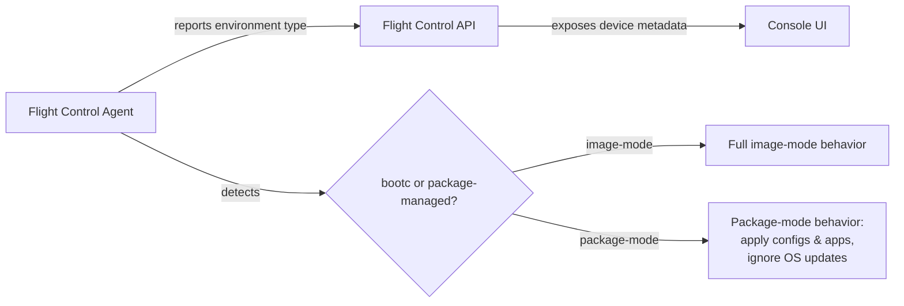

# Support Flight Control Agent on Non-Image-Mode Devices

| Field       | Value                                              |
|-------------|----------------------------------------------------|
| Author(s)   | Andy Dalton, Claude                                |
| Status      | Draft                                              |
| Jira        | EDM-1471                                           |
| Date        | 2026-04-01                                         |

## 1. Problem Statement

Flight Control Agent is primarily designed and tested for bootc-managed, image-based deployments where the OS is delivered as a pre-built image. However, many customers run traditional Linux systems where the OS is managed through package managers (yum/dnf for RHEL, apt for Ubuntu) rather than through OS image updates. These customers cannot use Flight Control to manage their devices without encountering errors, incorrect behavior, or conflicts with their system package managers. Without this work, Flight Control is limited to image-mode deployments, excluding a significant portion of the edge device landscape where traditional package-based Linux installations are the norm.

## 2. Goals and Non-Goals

### 2.1 Goals

- The Flight Control agent installs and runs correctly on RHEL 9.x, RHEL 10.x, and Ubuntu 24.04 LTS hosts managed by traditional package managers (non-bootc).
- The agent automatically detects whether it is running in a bootc-managed or package-managed environment and adapts its behavior accordingly, without generating errors or interfering with system package management.
- All existing agent application management capabilities (container workloads and other supported deployment mechanisms) function correctly on non-image-mode hosts.
- The Flight Control API exposes each device's environment type (image-mode vs. package-mode), and the console UI displays this information to operators.
- Existing image-mode deployments continue to work without regressions.

### 2.2 Non-Goals

- **OS-level update management.** OS updates remain managed by the system's native package manager (yum/dnf, apt). The agent does not manage or interfere with OS package updates.
- **Creating .deb packages for Ubuntu.** Debian package creation is handled by separate work. This PRD assumes .deb packages will be available; manual installation is the fallback.
- **Support for other Linux distributions.** Only RHEL (9.x, 10.x) and Ubuntu (24.04 LTS) are in scope. Other distributions (Debian, Fedora IoT, etc.) are not covered.
- **Changes to image-mode functionality.** Existing bootc/image-mode support remains unchanged.
- **New application management mechanisms.** The agent's existing application deployment capabilities are extended to non-image-mode hosts; no new deployment paradigms are introduced.

## 3. User Stories

- As a system administrator, I want to install the Flight Control agent on my RHEL or Ubuntu package-managed host so that I can manage my devices using Flight Control without requiring bootc image deployments.
- As a Flight Control user, I want the agent to automatically detect when it is running in a non-bootc environment so that it adapts its behavior appropriately and avoids conflicts with system package managers.
- As a system administrator, I want the agent to apply Flight Control application and configuration updates while ignoring OS-level updates so that I can manage my applications through Flight Control while maintaining control over OS updates through traditional package managers.
- As a Flight Control user, I want the agent to work correctly on both RHEL and Ubuntu systems so that I can use Flight Control across my heterogeneous infrastructure.
- As a Flight Control operator, I want to see whether each device is running in image-mode or package-mode in the console UI so that I can understand the deployment model of each device and troubleshoot accordingly.

## 4. Requirements

### 4.1 Functional Requirements

#### Agent Installation

- FR-1: The agent must be installable on RHEL 9.x and 10.x non-image-mode hosts via RPM package. *(From Jira acceptance criteria #1)*
- FR-2: The agent must be installable on Ubuntu 24.04 LTS non-image-mode hosts via .deb package (when available) or manual installation. *(From Jira acceptance criteria #1, refined by clarification Round 2 Q2)*
- FR-3: Installation must complete without errors, satisfy all required dependencies, and the agent service must start successfully. *(From Jira acceptance criteria #1)*

#### Environment Detection

- FR-4: The agent must automatically detect whether it is running in a bootc-managed (image-mode) or package-managed (non-image-mode) environment. *(From Jira acceptance criteria #2; detection mechanism is an engineering implementation detail per clarification Round 1 Q2)*
- FR-5: The agent must correctly identify the host platform (RHEL vs. Ubuntu). *(From Jira acceptance criteria #2)*
- FR-6: The agent must not generate errors or misbehave when operating in a non-image-mode environment. *(From Jira acceptance criteria #2)*
- FR-7: The agent status must report the OS type. *(From Jira acceptance criteria #2)*

#### Application and Configuration Management

- FR-8: The agent must apply configuration updates managed through Flight Control on both RHEL and Ubuntu non-image-mode hosts. *(From Jira acceptance criteria #3)*
- FR-9: The agent must support all existing application deployment and update mechanisms (containerized workloads and other currently supported methods) on non-image-mode hosts. *(From Jira acceptance criteria #3, refined by clarification Round 1 Q3 and Round 2 Q1)*
- FR-10: The agent must not manage, trigger, or interfere with OS-level package updates (yum/dnf, apt). *(From Jira acceptance criteria #3)*
- FR-11: Application and configuration update operations must complete successfully without conflicts with system package management. *(From Jira acceptance criteria #3)*

#### API and Console UI

- FR-12: The Flight Control API must expose each device's environment type (image-mode vs. package-mode). *(From clarification Round 2 Q4)*
- FR-13: The console UI must display a visible indicator on the device detail view showing whether a device is running in image-mode or package-mode, with explanatory text. *(From user story #5, Jira attachment package-mode.png, and clarification Round 1 Q5 and Round 2 Q4)*

### 4.2 Non-Functional Requirements

- NFR-1: **Backward compatibility.** All existing image-mode deployments must continue to function without regressions. *(From Jira out-of-scope: "Backward compatibility breaking changes")*
- NFR-2: **Platform support.** The agent must support RHEL 9.x, RHEL 10.x, and Ubuntu 24.04 LTS. *(From clarification Round 1 Q4)*
- NFR-3: **System stability.** The agent must not disrupt host system operations, services, or package management on non-image-mode hosts. *(From Jira acceptance criteria #2 and #3)*

## 5. Acceptance Criteria

- [ ] The Flight Control agent installs successfully via RPM on a RHEL 9.x non-image-mode host and the agent service starts without errors.
- [ ] The Flight Control agent installs successfully via RPM on a RHEL 10.x non-image-mode host and the agent service starts without errors.
- [ ] The Flight Control agent installs successfully on an Ubuntu 24.04 LTS non-image-mode host (via .deb package or manual installation) and the agent service starts without errors.
- [ ] The agent correctly detects that it is running in a non-image-mode (package-managed) environment on both RHEL and Ubuntu hosts.
- [ ] The agent correctly identifies the host platform (RHEL vs. Ubuntu) and reports the OS type in its status.
- [ ] The agent applies Flight Control configuration updates on RHEL and Ubuntu non-image-mode hosts without errors.
- [ ] The agent deploys and updates containerized workloads (and other currently supported application types) on RHEL and Ubuntu non-image-mode hosts without errors.
- [ ] The agent does not trigger, manage, or interfere with OS-level package operations (yum/dnf on RHEL, apt on Ubuntu).
- [ ] The Flight Control API returns the device's environment type (image-mode or package-mode) for enrolled devices.
- [ ] The console UI displays a "Package mode" indicator on the device detail view for non-image-mode devices, with explanatory text.
- [ ] All existing image-mode automated tests continue to pass with no regressions.
- [ ] Automated tests validate agent installation, environment detection, and application management on RHEL non-image-mode hosts.
- [ ] Automated tests validate agent installation, environment detection, and application management on Ubuntu non-image-mode hosts.

## 6. Design Overview

The feature spans three components: the Flight Control agent, the Flight Control API, and the console UI.

**Agent:** At startup (or enrollment), the agent detects whether the host is bootc-managed or package-managed. In package-mode, the agent continues to manage configurations and applications using its existing mechanisms but skips any OS image update logic. The detection mechanism is an engineering implementation detail.

**API:** A new or extended field on the device resource exposes the environment type reported by the agent. This allows API consumers (including the UI) to distinguish between image-mode and package-mode devices.

**UI:** The console displays a "Package mode" indicator on the device detail view (Inventory > Systems > specific device). The indicator includes explanatory text describing what package-mode means. [Assumption: The exact UI placement and styling follows the pattern shown in the `package-mode.png` attachment from the Jira issue.]

## 7. Alternatives Considered

| Alternative | Pros | Cons | Rejection Reason |
|-------------|------|------|------------------|
| Do nothing — require all managed devices to use bootc image-mode | No engineering effort; simpler support matrix | Excludes customers with traditional package-managed Linux infrastructure; limits Flight Control adoption | Customers are already deploying on non-image-mode hosts and encountering issues. Excluding them is not viable. |
| Agent configuration flag instead of auto-detection | Simple to implement; explicit user control | Requires manual configuration per device; error-prone at scale; worse user experience | Auto-detection provides a better experience and reduces misconfiguration risk. A config flag could be added as an override if auto-detection proves insufficient. |
| Support all Linux distributions, not just RHEL and Ubuntu | Broader adoption | Significantly larger testing matrix; higher maintenance burden; many distros have low demand | RHEL and Ubuntu cover the primary customer demand (per linked RFEs EDMRFE-50 and EDMRFE-46). Other distros can be added incrementally based on demand. |

## 8. Dependencies

- **Ubuntu .deb packages (external, parallel):** .deb package creation is handled by separate work. Until .deb packages are available, Ubuntu installation relies on manual installation. This feature is not blocked by .deb availability.
- **QE test infrastructure (parallel):** QE provisions RHEL and Ubuntu test environments (including e2e runners) in parallel with engineering development. Engineering can develop and test locally while CI infrastructure is set up.
- **Console UI team:** UI changes to display the package-mode indicator require coordination with the console UI team. API changes exposing environment type must land before or concurrently with UI changes.

## 9. Risks and Open Questions

| Item | Owner | Status | Outcome |
|------|-------|--------|---------|
| QE testing effort is disproportionately large relative to engineering effort (flagged by Sam Batschelet). Engineering involvement in e2e test development may be needed. | Engineering + QE | Open | |
| .deb package availability timing — if .deb packages are delayed, Ubuntu testing is limited to manual installation scenarios. | To be determined | Open | |
| Auto-detection reliability — the mechanism for detecting bootc vs. package-managed environments must be robust across all supported OS versions and configurations. | Engineering | Open | |
| Ubuntu manual installation path needs clear documentation — without .deb packages, the installation procedure must be well-documented to avoid support burden. | Engineering + Docs | Open | |
