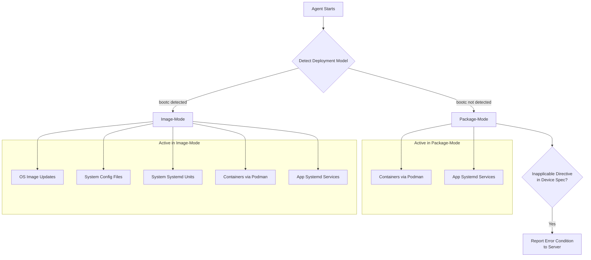
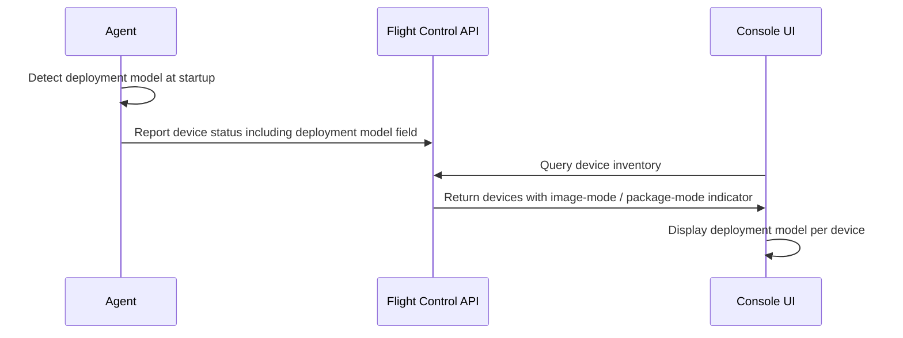

# Support Flight Control Agent on Non-Image-Mode Devices

| Field       | Value   |
|-------------|---------|
| Author(s)   | Andy Dalton, Claude (AI co-author) |
| Status      | Draft   |
| Jira        | [EDM-1471](https://issues.redhat.com/browse/EDM-1471) |
| Date        | 2026-04-02 |

## 1. Problem Statement

Flight Control Agent is primarily designed and tested for bootc-managed, image-based deployments where the OS is delivered as a pre-built image. However, many customers run traditional Linux systems where the OS is managed through package managers (yum/dnf on RHEL, apt on Ubuntu) rather than through OS image updates. [Jira: EDM-1471] These customers cannot use Flight Control to manage workloads on their existing infrastructure without either converting to image-mode — which is disruptive and often impractical — or accepting undefined agent behavior on unsupported configurations. [Jira: EDM-1471, comment by @Avishay Traeger] Related customer requests (EDMRFE-50, EDMRFE-46) reinforce demand for managing non-bootc devices, particularly Ubuntu systems and heterogeneous fleets spanning multiple distributions. [Jira: EDMRFE-50] [Jira: EDMRFE-46]

Without this work, Flight Control cannot serve customers with traditional package-managed Linux deployments, limiting its addressable market to bootc-only environments.

## 2. Goals and Non-Goals

### 2.1 Goals

- The Flight Control agent installs and runs correctly on non-image-mode RHEL (9, 10) and Ubuntu (22.04, 24.04) hosts on both x86_64 and ARM/aarch64 architectures. [Jira: EDM-1471] [Clarify: R1.Q2] [Clarify: R1.Q5]
- The agent automatically detects that it is running in a non-bootc environment and adapts its behavior accordingly — managing containers (podman) and application-level systemd services while leaving OS updates, system configuration files, and system-defined systemd units untouched. [Jira: EDM-1471] [Clarify: R2.Q1] [Clarify: R2.Q2]
- The device status API exposes whether a device is running in image-mode or package-mode, enabling the console UI to display the deployment model per device. [Jira: EDM-1471] [Clarify: R2.Q3]
- The agent reports a clear error condition when it encounters device spec directives that are not applicable in non-image-mode (e.g., OS image update directives). [Clarify: R3.Q1]

### 2.2 Non-Goals

- **OS-level update management.** OS updates remain managed by system package managers (yum/dnf, apt). The agent does not trigger, schedule, or interfere with OS package operations. [Jira: EDM-1471]
- **Creating .deb packages for Ubuntu.** A .deb package may already exist; this feature does not include building or maintaining one. [Jira: EDM-1471] [Clarify: R1.Q1]
- **Support for distributions beyond RHEL and Ubuntu.** Fedora IoT, Debian, and other distributions are not in scope. [Jira: EDM-1471]
- **Image-mode functionality changes.** Existing bootc image-mode behavior remains unchanged. [Jira: EDM-1471]
- **Agent self-update.** The agent does not update its own binary in non-image-mode. [Clarify: R1.Q4]
- **Console UI implementation.** The API must expose image-mode vs. package-mode status; the UI rendering is handled separately. [Clarify: R2.Q3]
- **Provisioning e2e test infrastructure.** RHEL/Ubuntu test runners are provisioned by the QE organization as a parallel effort. [Clarify: R2.Q4]

## 3. User Stories

- As a system administrator, I want to install the Flight Control agent on my RHEL or Ubuntu host, so that I can manage my devices using Flight Control without requiring bootc image deployments. [Jira: EDM-1471]
- As a Flight Control user, I want the agent to automatically detect when it is running in a non-bootc environment, so that it adapts its behavior appropriately and avoids conflicts with system package managers. [Jira: EDM-1471]
- As a system administrator, I want the agent to manage containers and application systemd services while leaving OS-level updates and system configuration alone, so that I maintain control over OS management through traditional package managers. [Jira: EDM-1471] [Clarify: R2.Q1]
- As a Flight Control user, I want the agent to work correctly on both RHEL and Ubuntu systems on x86_64 and ARM/aarch64, so that I can use Flight Control across my heterogeneous infrastructure. [Jira: EDM-1471] [Clarify: R1.Q5]
- As a Flight Control operator, I want to see whether each device is running in image-mode or package-mode via the API and console UI, so that I can understand the deployment model and troubleshoot accordingly. [Jira: EDM-1471] [Clarify: R2.Q3]
- As a system administrator, I want the agent to report a clear error when my device spec includes directives that are not applicable in non-image-mode, so that I can correct my configuration. [Clarify: R3.Q1]

## 4. Requirements

### 4.1 Functional Requirements

#### Installation

- **FR-1:** The agent must install on RHEL 9 and RHEL 10 non-image-mode hosts via RPM. Installation must complete without errors and satisfy all required dependencies. [Jira: EDM-1471] [Clarify: R1.Q2]
- **FR-2:** The agent must install on Ubuntu 22.04 and 24.04 non-image-mode hosts. Supported installation methods include: existing .deb package (if available), pre-built binary with systemd unit file, or script-based installer. This feature does not include creating or maintaining a .deb package. [Jira: EDM-1471] [Clarify: R1.Q1]
- **FR-3:** The agent must install and operate on both x86_64 and ARM/aarch64 architectures. [Clarify: R1.Q5]
- **FR-4:** The agent service must start successfully via systemd after installation on all supported platforms. [Jira: EDM-1471]

#### Environment Detection

- **FR-5:** The agent must automatically detect whether it is running in a bootc-managed (image-mode) or non-bootc (package-mode) environment at startup. The detection mechanism is an implementation detail. [Jira: EDM-1471] [Clarify: R1.Q3]
- **FR-6:** The agent must correctly identify the host platform (RHEL vs. Ubuntu) and report the OS type in its status. [Jira: EDM-1471]

#### Workload Management in Non-Image-Mode

- **FR-7:** The agent must manage containers via podman on non-image-mode hosts, applying desired state as defined by the Flight Control server. [Jira: EDM-1471] [Clarify: R2.Q1] [Clarify: R2.Q2]
- **FR-8:** The agent must manage application-level systemd services on non-image-mode hosts. [Clarify: R2.Q1] [Clarify: R2.Q2]
- **FR-9:** The agent must not manage OS image updates, system configuration files, or system-defined systemd units on non-image-mode hosts. [Clarify: R2.Q1]
- **FR-10:** The agent must not interfere with system package management operations (yum/dnf on RHEL, apt on Ubuntu). [Jira: EDM-1471]

#### Error Handling

- **FR-11:** When the agent encounters device spec directives that are not applicable in non-image-mode (e.g., OS image update directives), it must report a condition/error back to the server rather than silently ignoring or attempting the operation. [Clarify: R3.Q1]

#### API

- **FR-12:** The device status API must expose whether a device is running in image-mode or package-mode, providing the information needed for the console UI to display the deployment model per device. [Jira: EDM-1471] [Clarify: R2.Q3]

#### Fleet Model

- **FR-13:** Image-mode and non-image-mode devices must not coexist in the same fleet. Administrators must create separate fleets for each deployment model. [Assumption: This is a simplifying constraint. Reviewers may push back in favor of mixed fleets. See Appendix.] [Clarify: R3.Q2]

### 4.2 Non-Functional Requirements

- **NFR-1:** Existing image-mode deployments must continue to work without regressions. All existing image-mode tests must continue to pass. [Jira: EDM-1471]
- **NFR-2:** No additional non-functional requirements are specified for non-image-mode beyond what applies to the agent generally. [Clarify: R3.Q3]

## 5. Acceptance Criteria

- [ ] The agent installs without errors on RHEL 9, RHEL 10, Ubuntu 22.04, and Ubuntu 24.04 non-image-mode hosts, on both x86_64 and aarch64.
- [ ] The agent service starts successfully via systemd on all supported platform/architecture combinations.
- [ ] The agent correctly detects non-image-mode at startup and reports the OS type and deployment model in its status.
- [ ] The agent applies container (podman) workload updates as specified by the Flight Control server on all supported non-image-mode platforms.
- [ ] The agent applies application-level systemd service updates on all supported non-image-mode platforms.
- [ ] The agent does not attempt OS image updates, modify system configuration files, or manage system-defined systemd units on non-image-mode hosts.
- [ ] The agent does not interfere with yum/dnf (RHEL) or apt (Ubuntu) package management operations.
- [ ] The agent reports a condition/error to the server when a device spec includes directives not applicable in non-image-mode.
- [ ] The device status API exposes image-mode vs. package-mode for each device.
- [ ] All existing image-mode tests continue to pass without regressions.
- [ ] Automated tests validate agent behavior on RHEL and Ubuntu non-image-mode hosts, covering environment detection, workload management, and error handling for inapplicable directives.

## 6. Design Overview

Design to follow in a separate document. Key architectural considerations include:

- The agent must branch behavior based on a detected deployment model (image-mode vs. package-mode) early in its startup sequence.
- Reconcilers that manage OS-level operations (bootc image updates, system config files, system-defined systemd units) must be disabled or bypassed in package-mode.
- The device status reporting path must be extended to include the deployment model field.
- Fleet membership validation must enforce that all devices in a fleet share the same deployment model. [Assumption: See FR-13.]

The following diagram illustrates how the agent's startup detection determines which capabilities are active in each deployment model. This is the central behavioral boundary of the feature.

The following diagram shows how the deployment model flows from the agent through the API to enable the console UI to distinguish device types.

## 7. Alternatives Considered

### 1. Require all devices to use image-mode (do nothing)

#### Pros

- No engineering effort required. The agent continues to target only bootc-managed systems.

#### Cons

- Excludes customers running traditional RHEL or Ubuntu installations, which represent a significant portion of edge deployments.
- Forces customers into a disruptive migration to image-mode before they can use Flight Control.
- Related RFEs (EDMRFE-50, EDMRFE-46) go unaddressed.

#### Rejection Reasons

- Customer demand for managing non-bootc devices is established and growing. Doing nothing limits Flight Control's addressable market.

### 2. Allow mixed-mode fleets (image-mode and package-mode devices in the same fleet)

#### Pros

- More flexible for administrators managing heterogeneous infrastructure; fewer fleets to configure and maintain.

#### Cons

- Fleet templates must be validated against each device's deployment model at apply time, increasing complexity.
- Risk of misapplying OS image update directives to package-mode devices if template validation is incomplete.

#### Rejection Reasons

- Adds significant complexity to fleet template validation and error handling. Separate fleets provide a clear boundary. This decision is flagged as an assumption — reviewers may prefer the mixed-fleet approach if the validation complexity is manageable. [Clarify: R3.Q2]

## 8. Dependencies

- **QE test infrastructure:** The QE organization must provision RHEL and Ubuntu non-image-mode test environments (runners) for e2e validation. This work proceeds in parallel with development. [Clarify: R2.Q4]
- **Console UI team:** The API exposes image-mode vs. package-mode status (in scope); the console UI must consume this field to display the deployment model per device (separate effort). [Clarify: R2.Q3]
- **Packaging:** RPM packages for RHEL must be available. For Ubuntu, an existing .deb, binary tarball, or installer script must be available or created as a prerequisite. [Clarify: R1.Q1]

## 9. Risks and Open Questions

### 1. Mixed-fleet support

Should image-mode and package-mode devices coexist in the same fleet? This PRD currently assumes separate fleets (FR-13), but this is a simplifying constraint that reviewers may challenge. If mixed fleets are required, fleet template validation becomes significantly more complex.

- **Owner:** PRD reviewers
- **Status:** Open
- **Outcome:**

### 2. Ubuntu installation path

If no .deb package exists and none is being built as part of this feature, the binary/tarball or script-based installer path needs validation. Engineering must confirm which mechanism(s) will be supported and tested.

- **Owner:** Engineering
- **Status:** Open
- **Outcome:**

### 3. QE effort relative to engineering effort

The testing requirements for this feature are disproportionately large relative to the engineering changes. Engineering involvement in e2e test development is needed to ensure successful delivery. [Jira: EDM-1471, comment by @Sam Batschelet]

- **Owner:** Engineering + QE
- **Status:** Open
- **Outcome:** Coordination acknowledged; to be revisited post-GA testing.

### 4. ARM/aarch64 testing coverage

Exploratory testing on Raspberry Pi 4 has begun (Luca Ferrari), but formal ARM test infrastructure has not been confirmed by QE. ARM is in scope for this feature, so test coverage must be addressed.

- **Owner:** QE
- **Status:** Open
- **Outcome:**

## Appendix: Review Notes

### Assumptions

- [FR-13, Section 4.1] Image-mode and non-image-mode devices cannot coexist in the same fleet. This is a simplifying constraint based on clarification with the PRD author, who flagged it as an assumption that reviewers may push back on. [Clarify: R3.Q2]
- [Section 6] Fleet membership validation enforces same deployment model — follows from the FR-13 assumption.

### Items Needing Resolution

- [Section 9] Mixed-fleet support decision — no owner or outcome assigned yet.
- [Section 9] Ubuntu installation path validation — needs engineering confirmation of which mechanism(s) will be supported.
- [Section 9] ARM/aarch64 test infrastructure — QE has not confirmed formal ARM test runners.
- [Section 9] Engineering + QE coordination on e2e test development — acknowledged but not yet planned.
