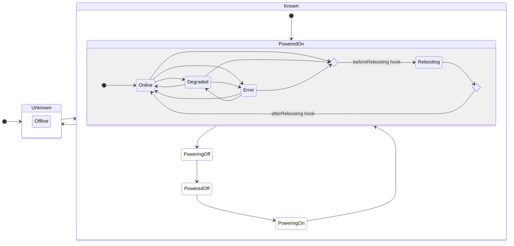
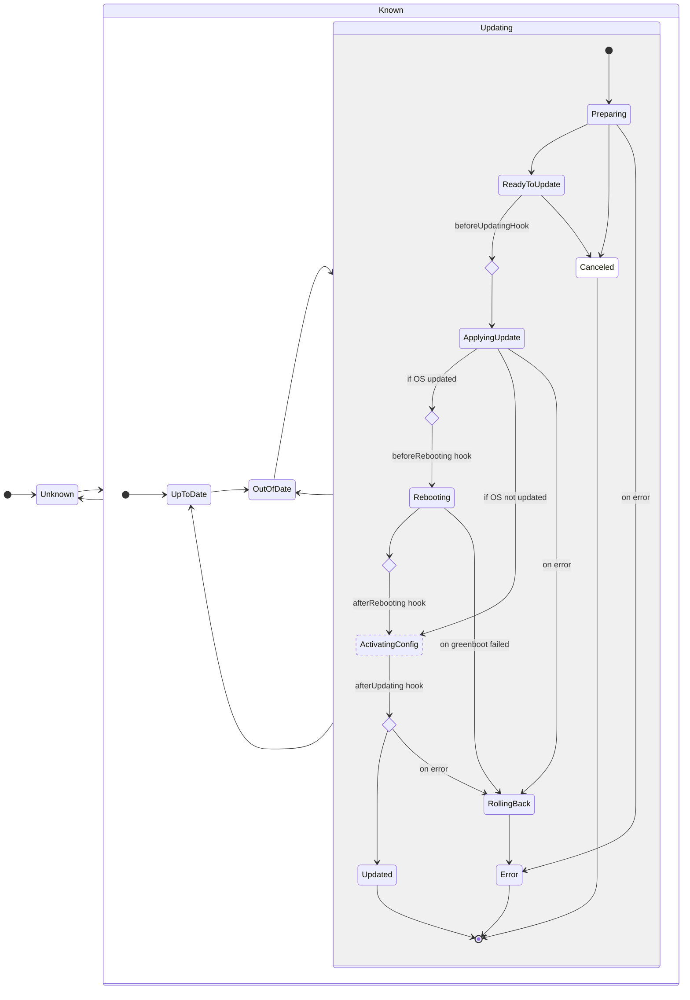
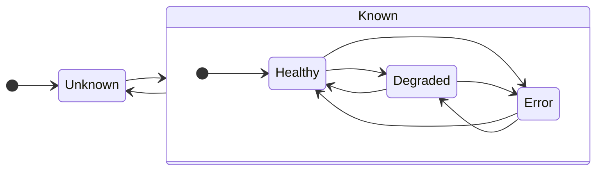

# Device API Statuses

The following sections document the various statuses reported by Flight Control's Device API. These statuses represent the _service's view_ of the managed device, which is the _last reported_ status from the device agent augmented by service's local context and user policies. The _last reported_ status in turn may be outdated relative to the agent's _current status_ due to reporting delays.

## Device Status

The Device Status represents the availability and health of the device's hardware resources and operating system.

The `device.status.summary` field can have the following values:

| Status              | Description                                                                                                                            | Formal Definition<sup>1</sub> |
|---------------------|----------------------------------------------------------------------------------------------------------------------------------------| ----------------------------- |
| `Online`            | All hardware resources and operating system services are reported to be healthy.                                                       | `!deviceIsDisconnected && !deviceIsRebooting && ∀ r∈{CPU, Memory, Disk}, status.resources[r]∈{Healthy}` |
| `Degraded`          | One or more hardware resources or operating system services are reported to be degraded but in a still functional or recovering state. | `!deviceIsDisconnected && !deviceIsRebooting && ∀ r∈{CPU, Memory, Disk}, status.resources[r]∉{Error, Critical} && ∃ r∈{CPU, Memory, Disk}, status.resources[r]∈{Degraded}` |
| `Error`             | One or more hardware resources or operating system services are reported to be in error or critical state.                             | `!deviceIsDisconnected && !deviceIsRebooting && ∃ r∈{CPU, Memory, Disk}, status.resources[r]∈{Error, Critical}` |
| `Rebooting`         | The device is rebooting.                                                                                                               | `!deviceIsDisconnected && deviceIsRebooting` |
| `Offline`           | The device is disconnected from the service but may still be running.                                                                  | `deviceIsDisconnected` |
| `AwaitingReconnect` | The device is awaiting reconnection after the system was restored.                                                                     | `deviceIsDisconnected` |
| `ConflictPaused`    | The device is paused because the device reported a renderedVersion not known to the service.                                           | `deviceIsDisconnected` |

<sup>1</sup> For the detailed definitions derived from the device specs and statuses, see [Helper Definitions](#helper-definitions).

The following state diagram shows the possible transitions between device statuses, including when the corresponding device lifecycle hooks would be called.



## Device Update Status

The Device Update Status represents whether the device's currently running specification (OS, configuration, applications, etc.) matches the user's intent as expressed via the device spec or the fleet's device template.

The `device.status.updated.status` field can have the following values:

| Status | Description | Formal Definition<sup>1</sub> |
| ------ | ----------- | ----------------------------- |
| `UpToDate` | The device is updated to its device spec. If the device is member of a fleet, its device spec is at the same template version as its fleet's device template. | `!deviceIsUpdating && deviceIsUpdatedToDeviceSpec && (deviceIsNotManaged \|\| deviceIsUpdatedToFleetSpec)` |
| `Updating` | The device is in the process of updating to its device spec. | `deviceIsUpdating` |
| `OutOfDate` | The device is not updating and either not updated to its device spec or - if it is member of a fleet - its spec is not yet of the same template version as its fleet's device template. | `!deviceIsUpdating && (!deviceIsUpdatedToDeviceSpec \|\| (deviceIsManaged && !deviceIsUpdatedToFleetSpec))` |
| `Unknown` | The device's agent either never reported status or its last reported status was `Updating` and the device has been disconnected since. | `deviceIsDisconnected && lastStatus == Updating` |

<sup>1</sup> For the detailed definitions derived from the device specs and statuses, see [Helper Definitions](#helper-definitions).

The `device.status.conditions.Updating.Reason` field contains the current state of the update in progress and can take the following values:

| Update State | Description |
| ------------ | ----------- |
| `Preparing` | The agent is validating the desired device spec and downloading dependencies. No changes have been made to the device's configuration yet. |
| `ReadyToUpdate` | The agent has validated the desired spec, downloaded all dependencies, and is ready to update. No changes have been made to the device's configuration yet. |
| `ApplyingUpdate` | The agent has started the update transaction and is writing the update to disk. |
| `Rebooting` | The agent initiated a reboot required to activate the new OS image and configuration. |
| `ActivatingConfig` | (transient, not reported) The agent is activating the new configuration without requiring a reboot. |
| `RollingBack` | The agent has detected an error and is rolling back to the pre-update OS image and configuration. |
| `Updated` | The agent has successfully completed the update and the device is conforming to its device spec. Note that the device's update status may still be reported as `OutOfDate` if the device spec is not yet at the same version as the fleet's device template. |
| `Error` | The agent failed to apply the desired spec and will not retry. The device's OS image and configuration have been rolled back to the pre-update version and have been activated. |

The `device.status.updated.info` field contains a human readable more detailed information about the last state transition.

The following state diagram shows the possible transitions between update statuses and states, including when the corresponding device lifecycle hooks would be called.



## Application Status

The Application Status represents a summary of the availability and health of all applications on the system.

The `device.status.applicationSummary` field can have the following values:

| Status | Description | Formal Definition<sup>1</sub> |
| ------ | ----------- | ----------------------------- |
| `Healthy` | All applications are reported to be in service or have successfully completed. | `!deviceIsDisconnected && ∀ a∈status.applications, status.applications[a]∈{Running, Completed}` |
| `Degraded` | One or more applications are reported to not be in service but still in a starting or recovering state. | `!deviceIsDisconnected && ∀ a∈status.applications, status.applications[a]∉{Error} && ∃ a∈status.applications, status.applications[a]∈{Preparing, Starting}` |
| `Error` | One or more applications are reported to be in error state. | `!deviceIsDisconnected && ∃ a∈status.applications, status.applications[a]∈{Error}` |
| `Unknown` | The device's agent either never reported status or the device is currently disconnected. | `deviceIsDisconnected` |

<sup>1</sup> For the detailed definitions derived from the device specs and statuses, see [Helper Definitions](#helper-definitions).

The following state diagram shows the possible transitions between application summary statuses.



## Helper Definitions

The formal definition uses the following helper definitions:

```golang
// A device is assumed disconnected if its agent hasn't sent an update for the duration of a disconnectionTimeout.
deviceIsDisconnected := device.lastSeen + disconnectionTimeout < time.Now()

// A device is not managed by a fleet if its owner field is unset.
deviceIsNotManaged := len(device.metadata.owner) == 0

// A device is rebooting when the agent sets the "Rebooting" condition to true.
deviceIsRebooting := device.status.conditions.rebooting == true

// A device is updating when the agent sets the "Updating" condition to true.
deviceIsUpdating := device.status.conditions.updating == true

// A device is updated to its device spec when the version of the device spec that the agent reports as running
// equals the version rendered to the device by the service.
deviceIsUpdatedToDeviceSpec := device.status.config.renderedVersion == device.metadata.annotations.renderedVersion

// A device is updated to it's fleet's spec when it is updated to its device spec and that device spec's
// template version matches the device's fleet's template version.
deviceIsUpdatedToFleetSoec := deviceIsUpdatedToDeviceSpec && device.metadata.annotations.templateVersion == fleet[device.metadata.owner].spec.templateVersion
```
