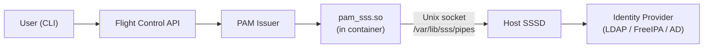

# PAM Issuer - OIDC Provider with PAM Authentication

This document describes how to use Flight Control's PAM Issuer, a built-in OpenID Connect (OIDC) provider that uses Linux PAM for user authentication.

## Table of Contents

- [Overview](#overview)
- [Architecture](#architecture)
- [Prerequisites](#prerequisites)
- [User Management](#user-management)
  - [Adding Users to PAM Issuer](#adding-users-to-pam-issuer)
- [Security Considerations](#security-considerations)
- [Connecting to SSSD](#connecting-to-sssd)
  - [SSSD Version Compatibility](#sssd-version-compatibility)
  - [Local Users Are Not Supported Through SSSD](#local-users-are-not-supported-through-sssd)
  - [Mounting SSSD Pipes](#mounting-sssd-pipes)
  - [Group Mapping for Roles and Organizations](#group-mapping-for-roles-and-organizations)
  - [Verification](#verification)
  - [Troubleshooting SSSD Integration](#troubleshooting-sssd-integration)

## Overview

For standalone and Quadlet deployments, Flight Control is configured to use **OIDC (OpenID Connect) authentication**. To provide a complete authentication solution without external dependencies, Flight Control deploys its own **OIDC provider implementation called PAM Issuer**.

**Key Points:**

- **Flight Control uses OIDC authentication** (the same protocol as external OIDC providers)
- **PAM Issuer is the OIDC provider** (Flight Control's built-in implementation)
- **PAM is used for user validation** (Linux PAM within the PAM Issuer container)

This architecture provides a complete, self-contained authentication solution while maintaining compatibility with standard OIDC flows.

## Architecture

### Components

1. **Flight Control API Server**
   - Configured with OIDC authentication type
   - Points to PAM Issuer as its OIDC provider
   - Validates JWT tokens issued by PAM Issuer

2. **PAM Issuer Service** (`flightctl-pam-issuer`)
   - Implements OpenID Connect (OIDC) provider specification
   - Provides standard OIDC endpoints (authorization, token, userinfo, etc.)
   - Uses Linux PAM for user credential validation
   - Manages its own user database within its container
   - Issues JWT tokens upon successful authentication

3. **Linux PAM**
   - Validates user credentials
   - Manages password policies

### Authentication Flow

1. User initiates login: `flightctl login --web`
2. Flight Control API redirects to **PAM Issuer's OIDC authorization endpoint**
3. PAM Issuer presents login form to user
4. User submits credentials (username/password)
5. PAM Issuer validates credentials using **Linux PAM**
6. Upon successful validation, PAM Issuer issues **OIDC-compliant JWT token**
7. Token is returned to Flight Control API
8. API validates the JWT token (signature, expiry, claims)
9. User is authenticated and can access Flight Control

This is the **same flow** as using an external OIDC provider (Google, Azure AD, etc.), except PAM Issuer is the OIDC provider and PAM is the user validation backend.

## Prerequisites

There are no special prerequisites for using PAM authentication. The PAM issuer service is included in Quadlet and standalone Flight Control deployments.

## Configuration

The PAM issuer is configured in the Flight Control configuration file (`/etc/flightctl/service-config.yaml`). The configuration is located under the `auth.pamOidcIssuer` section.

### Configuration Options

```yaml
auth:
  pamOidcIssuer:
    address: ":8444"                                    # Listen address for the PAM issuer service
    issuer: "https://localhost:8444/api/v1/auth"       # Base URL for the OIDC issuer
    clientId: "flightctl-client"                       # OAuth2 client ID
    clientSecret: ""                                    # OAuth2 client secret (empty for public clients)
    scopes:                                             # Supported OAuth2 scopes
      - "openid"
      - "profile"
      - "email"
      - "roles"
    redirectUris:                                       # Allowed redirect URIs for OAuth2 flows
      - "http://localhost:7777/callback"
    pamService: "flightctl"                            # PAM service name (default: "flightctl")
    allowPublicClientWithoutPKCE: false                # SECURITY: Allow public clients without PKCE (not recommended)
    accessTokenExpiration: "1h"                         # Expiration duration for access tokens and ID tokens (default: "1h")
    refreshTokenExpiration: "168h"                     # Expiration duration for refresh tokens (default: "168h", equivalent to 7 days)
    pendingSessionCookieMaxAge: "10m"                  # MaxAge duration for pending session cookies (default: "10m")
    authenticatedSessionCookieMaxAge: "30m"            # MaxAge duration for authenticated session cookies (default: "30m")
```

### Configuration Parameters

| Parameter | Description | Default |
|-----------|-------------|---------|
| `address` | Listen address for the PAM issuer service | `:8444` |
| `issuer` | Base URL for the OIDC issuer. Must match where `.well-known/openid-configuration` is served | Service base URL |
| `clientId` | OAuth2 client ID for authentication | `flightctl-client` |
| `clientSecret` | OAuth2 client secret. Leave empty for public clients (CLI) | Empty |
| `scopes` | OAuth2 scopes supported by the issuer | `["openid", "profile", "email", "roles"]` |
| `redirectUris` | Allowed redirect URIs for OAuth2 authorization code flow | Based on service base URL |
| `pamService` | PAM service name to use for authentication (must match `/etc/pam.d/<name>`) | `flightctl` |
| `allowPublicClientWithoutPKCE` | Allow public clients to skip PKCE requirement. **Security Warning**: Only enable for testing | `false` |
| `accessTokenExpiration` | Expiration duration for access tokens and ID tokens (e.g., `1h`, `30m`) | `1h` |
| `refreshTokenExpiration` | Expiration duration for refresh tokens (e.g., `168h`, `720h`) | `168h` |
| `pendingSessionCookieMaxAge` | MaxAge duration for pending session cookies (e.g., `10m`, `15m`) | `10m` |
| `authenticatedSessionCookieMaxAge` | MaxAge duration for authenticated session cookies (e.g., `30m`, `1h`) | `30m` |

### Default Configuration

If the `pamOidcIssuer` section is present in the configuration file, the following defaults are automatically applied:

- **PAM Service**: Defaults to `"flightctl"`
- **Issuer URL**: Defaults to the service's base URL if not specified
- **Client ID**: Defaults to `"flightctl-client"`
- **Scopes**: Defaults to `["openid", "profile", "email", "roles"]`
- **Redirect URIs**: Automatically configured based on the service's base UI URL or base URL
- **Access Token Expiration**: Defaults to `1h`
- **Refresh Token Expiration**: Defaults to `168h` (7 days)
- **Pending Session Cookie MaxAge**: Defaults to `10m` (10 minutes)
- **Authenticated Session Cookie MaxAge**: Defaults to `30m` (30 minutes)

### Security Note

The `allowPublicClientWithoutPKCE` parameter should remain `false` (default) in production environments. PKCE (Proof Key for Code Exchange) is required for public clients per OAuth 2.0 Security Best Current Practice. Only enable this setting for testing or backward compatibility with legacy clients.

### Token Expiration

Token expiration times are configurable via `accessTokenExpiration` and `refreshTokenExpiration` parameters. By default, access tokens and ID tokens expire after **1 hour**, and refresh tokens expire after **168 hours (7 days)**.

## User Management

### Adding Users to PAM Issuer

For security reasons, the PAM issuer manages its own users within its container. This isolation ensures that authentication credentials are contained within the PAM issuer service and do not affect the host system.

To add a user to the PAM issuer:

#### Step 1: Create role groups (these are not created by default)

```bash
# Create the flightctl-admin group for global administrators
sudo podman exec -i flightctl-pam-issuer groupadd flightctl-admin

# Optionally create other role groups as needed
sudo podman exec -i flightctl-pam-issuer groupadd flightctl-operator
sudo podman exec -i flightctl-pam-issuer groupadd flightctl-viewer
```

**Note:** Role groups must be created manually. Future versions will create these automatically.

#### Step 2: Create a new user

```bash
sudo podman exec flightctl-pam-issuer adduser <USER>
```

#### Step 3: Set the user's password using `chpasswd`

```bash
sudo podman exec -i flightctl-pam-issuer sh -c 'echo "<USER>:<PASSWORD>" | chpasswd'
```

#### Step 4: Add the user to a role group

```bash
sudo podman exec -i flightctl-pam-issuer usermod -aG flightctl-admin <USER>
```

**Example:**

```bash
# Step 1: Create the flightctl-admin group
sudo podman exec -i flightctl-pam-issuer groupadd flightctl-admin

# Step 2: Add user 'alice'
sudo podman exec flightctl-pam-issuer adduser alice

# Step 3: Set password for 'alice'
sudo podman exec -i flightctl-pam-issuer sh -c 'echo "alice:mypassword" | chpasswd'

# Step 4: Add alice to flightctl-admin group
sudo podman exec -i flightctl-pam-issuer usermod -aG flightctl-admin alice
```

**Complete one-liner for convenience:**

```bash
# Create group, create user, set password, and add to admin group
USER=alice
PASSWORD=mypassword
sudo podman exec -i flightctl-pam-issuer groupadd flightctl-admin 2>/dev/null || true && \
sudo podman exec flightctl-pam-issuer adduser $USER && \
sudo podman exec -i flightctl-pam-issuer sh -c "echo \"$USER:$PASSWORD\" | chpasswd" && \
sudo podman exec -i flightctl-pam-issuer usermod -aG flightctl-admin $USER
```

**Note:** The `2>/dev/null || true` suppresses the error if the group already exists.

**Note:** Currently, role groups are not created automatically in the PAM issuer container. You must create them manually using `groupadd` before assigning users to roles. If you get an error that a group already exists, you can safely ignore it and proceed with creating users.

## Roles and Organizations

PAM authentication uses Linux groups to manage user roles and organization membership. Understanding this mapping is essential for configuring proper access control.

### Organization Assignment

Users are assigned to organizations by adding them to groups with the naming pattern `org-<ORGANIZATION_NAME>`:

- Group name: `org-XXX`
- Organization: `XXX`

**Example:**

```bash
# Create organization groups
sudo podman exec -i flightctl-pam-issuer groupadd org-engineering
sudo podman exec -i flightctl-pam-issuer groupadd org-operations

# Add user to the 'engineering' organization
sudo podman exec -i flightctl-pam-issuer usermod -aG org-engineering alice

# Add user to the 'operations' organization
sudo podman exec -i flightctl-pam-issuer usermod -aG org-operations bob
```

A user can belong to multiple organizations by being a member of multiple `org-*` groups.

### Role Assignment

Roles control what actions users can perform. Roles can be either **global** (apply across all organizations) or **organization-scoped** (apply only within a specific organization).

#### Global Roles

Global roles are assigned using group names without an organization prefix:

- Group name: `role-name`
- Scope: Global (all organizations)

**Example:**

```bash
# Create global role groups
sudo podman exec -i flightctl-pam-issuer groupadd flightctl-admin
sudo podman exec -i flightctl-pam-issuer groupadd flightctl-viewer

# Add user to global admin role
sudo podman exec -i flightctl-pam-issuer usermod -aG flightctl-admin alice
```

#### Organization-Scoped Roles

Organization-scoped roles are assigned using the pattern `<ORGANIZATION>.<ROLE>`:

- Group name: `XXX.my-role`
- Organization: `XXX`
- Role: `my-role` (within organization XXX)

**Example:**

```bash
# Create organization-scoped role groups
sudo podman exec -i flightctl-pam-issuer groupadd engineering.flightctl-operator
sudo podman exec -i flightctl-pam-issuer groupadd operations.flightctl-org-admin

# Add user to 'flightctl-operator' role in 'engineering' organization
sudo podman exec -i flightctl-pam-issuer usermod -aG engineering.flightctl-operator alice

# Add user to 'flightctl-org-admin' role in 'operations' organization
sudo podman exec -i flightctl-pam-issuer usermod -aG operations.flightctl-org-admin bob
```

### Common Roles

Flight Control supports the following external role names:

| Role Name | Description | Typical Scope |
|-----------|-------------|---------------|
| `flightctl-admin` | Full administrative access | **Must be global** |
| `flightctl-org-admin` | Organization administrator | Can be org-scoped or global |
| `flightctl-operator` | Manage devices, fleets; imagebuilds (cancel, logs); imageexports (cancel, download, logs) | Can be org-scoped or global |
| `flightctl-viewer` | Read-only access; imagebuilds/imageexports with logs (no download) | Can be org-scoped or global |
| `flightctl-installer` | Device provisioning; view imagebuilds/imageexports; download imageexports | Can be org-scoped or global |

**Important Notes:**

- The `flightctl-admin` role **must be global** and cannot be organization-scoped
- **These groups are not created automatically** - you must create them manually using `groupadd`
- Future versions will create these groups automatically

### Complete User Setup Example

Here's a complete example setting up users with organizations and roles:

```bash
# Create organization groups
sudo podman exec -i flightctl-pam-issuer groupadd org-engineering
sudo podman exec -i flightctl-pam-issuer groupadd org-operations

# Create global role groups (NOTE: not created by default, must be created manually)
sudo podman exec -i flightctl-pam-issuer groupadd flightctl-admin
sudo podman exec -i flightctl-pam-issuer groupadd flightctl-viewer
sudo podman exec -i flightctl-pam-issuer groupadd flightctl-operator
sudo podman exec -i flightctl-pam-issuer groupadd flightctl-org-admin
sudo podman exec -i flightctl-pam-issuer groupadd flightctl-installer

# Create organization-scoped role groups
sudo podman exec -i flightctl-pam-issuer groupadd engineering.flightctl-operator
sudo podman exec -i flightctl-pam-issuer groupadd operations.flightctl-org-admin

# Create admin user with global access
sudo podman exec flightctl-pam-issuer adduser admin
sudo podman exec -i flightctl-pam-issuer sh -c 'echo "admin:adminpass" | chpasswd'
sudo podman exec -i flightctl-pam-issuer usermod -aG flightctl-admin admin

# Create engineering operator
sudo podman exec flightctl-pam-issuer adduser alice
sudo podman exec -i flightctl-pam-issuer sh -c 'echo "alice:alicepass" | chpasswd'
sudo podman exec -i flightctl-pam-issuer usermod -aG org-engineering alice
sudo podman exec -i flightctl-pam-issuer usermod -aG engineering.flightctl-operator alice

# Create operations organization admin
sudo podman exec flightctl-pam-issuer adduser bob
sudo podman exec -i flightctl-pam-issuer sh -c 'echo "bob:bobpass" | chpasswd'
sudo podman exec -i flightctl-pam-issuer usermod -aG org-operations bob
sudo podman exec -i flightctl-pam-issuer usermod -aG operations.flightctl-org-admin bob

# Create read-only viewer with global access
sudo podman exec flightctl-pam-issuer adduser charlie
sudo podman exec -i flightctl-pam-issuer sh -c 'echo "charlie:charliepass" | chpasswd'
sudo podman exec -i flightctl-pam-issuer usermod -aG flightctl-viewer charlie
```

In this example:

- **admin**: Global administrator (all permissions everywhere)
- **alice**: Operator in the engineering organization
- **bob**: Organization admin in the operations organization
- **charlie**: Read-only viewer globally

### Viewing User Groups

To verify which groups (and thus roles/organizations) a user belongs to:

```bash
sudo podman exec flightctl-pam-issuer groups <USER>
```

**Example:**

```bash
$ sudo podman exec flightctl-pam-issuer groups alice
alice : alice org-engineering engineering.flightctl-operator
```

This shows that `alice` belongs to:

- The `engineering` organization (via `org-engineering`)
- The `flightctl-operator` role within the `engineering` organization (via `engineering.flightctl-operator`)

## Security Considerations

### User Isolation

By default, the PAM issuer maintains its own user database within the container. This provides:

- **Isolation**: Authentication credentials are separate from the host system
- **Security**: Compromised PAM issuer credentials do not affect host system access
- **Portability**: User management is self-contained within the service

### Password Management

- Use strong passwords for all PAM issuer users
- Regularly rotate passwords following your organization's security policies
- Consider implementing password complexity requirements through PAM configuration

### Access Control

- Only grant PAM issuer access to users who require Flight Control administrative capabilities
- Review user access regularly and remove accounts that are no longer needed
- Monitor authentication logs for suspicious activity

## Connecting to SSSD

Instead of managing users inside the PAM Issuer container, you can connect it to the host's System Security Services Daemon (SSSD). This allows PAM Issuer to authenticate users from an external identity provider such as LDAP, FreeIPA, or Active Directory.

The PAM Issuer container ships with `sssd-client` (including `pam_sss.so`) pre-configured. The only additional configuration required is mounting the host's SSSD pipes into the container.

The following diagram shows the authentication flow when SSSD is configured:



### SSSD version compatibility

The PAM Issuer container includes `sssd-client` from CentOS Stream 9, which is SSSD **`2.9.x`**.

**Supported:** Host SSSD `2.9.x` (for example, RHEL 9 or CentOS Stream 9). The container's `sssd-client` and the host SSSD daemon are the same major version, and SSSD runs as root by default.

**Not supported:** Host SSSD **2.10.0 and later** (for example, Fedora 41 and later). There is no workaround for this incompatibility.

The PAM Issuer container runs as root, so the `2.9.x` `sssd-client` always connects through the privileged PAM socket at `/var/lib/sss/pipes/private/pam`. SSSD 2.10.0 removed this socket entirely. On a compatible `2.9.x` host, this socket is present inside the mounted `pipes` directory:

```text
/var/lib/sss/pipes/           # mounted from the host
├── nss                       # NSS socket
├── pam                       # public PAM socket (permissions 0666)
└── private/
    └── pam                   # privileged PAM socket (permissions 0600) - removed in 2.10.0
```

In addition, the `2.9.x` client verifies that the socket is owned by `root:root` and that the SSSD responder process runs as root (`SO_PEERCRED` check). SSSD 2.10.0 defaults to running as the unprivileged `sssd` user, which fails both checks.

NSS lookups (`getent passwd`) may still work on a 2.10.0 host because the NSS client does not perform these ownership checks. However, PAM authentication fails silently.

Verify your host SSSD version before proceeding:

```bash
rpm -q sssd
```

### Local users are not supported through SSSD

SSSD integration requires an external identity provider (LDAP, FreeIPA, or Active Directory). Local users defined in `/etc/passwd` and `/etc/shadow` cannot be authenticated through SSSD because the SSSD proxy provider's `proxy_child` process cannot perform cross-user password checks when running as a non-root user (due to `unix_chkpwd` restrictions).

For local users, use the built-in PAM Issuer user management described in the [Adding users to PAM Issuer](#adding-users-to-pam-issuer) section.

### Mounting SSSD pipes

Before you begin, verify the following prerequisites on the host:

- SSSD is installed, configured, and running with an external identity provider
- `/etc/nsswitch.conf` includes `sss` in the `passwd` and `group` entries
- User resolution works on the host (`id <user>` returns a result)
- PAM authentication works on the host (validate with `pamtester`)

#### Procedure

1. Edit the PAM Issuer container quadlet file:

   ```bash
   sudo vi /etc/containers/systemd/flightctl-pam-issuer.container
   ```

2. Add the following line to the `[Container]` section:

   ```ini
   Volume=/var/lib/sss/pipes:/var/lib/sss/pipes:rw
   ```

3. Reload the systemd daemon and restart the service:

   ```bash
   systemctl daemon-reload && systemctl restart flightctl-pam-issuer.service
   ```

**Note:** If SELinux is enforcing, you may need a targeted policy module to allow the container to access the SSSD pipes. After an access denial, generate one with:

```bash
ausearch -m avc -ts recent | audit2allow -M flightctl-sssd
semodule -i flightctl-sssd.pp
```

### Group mapping for roles and organizations

When SSSD resolves user groups from the identity provider, those groups must follow the same naming conventions as the built-in PAM Issuer groups. The [Roles and Organizations](#roles-and-organizations) section describes the full naming scheme. In summary:

- **Global roles:** `flightctl-admin`, `flightctl-operator`, `flightctl-viewer`, `flightctl-installer`, `flightctl-org-admin`
- **Organization groups:** `org-<organization_name>`
- **Organization-scoped roles:** `<organization_name>.<role>`

Groups in the identity provider must be POSIX groups with `gidNumber` attributes for SSSD to resolve them.

### Verification

1. Verify that the SSSD pipes are accessible from the container:

   ```bash
   sudo podman exec flightctl-pam-issuer ls -la /var/lib/sss/pipes/
   ```

2. Verify that NSS resolution works from the container:

   ```bash
   sudo podman exec flightctl-pam-issuer getent passwd <user>
   ```

3. Verify that group resolution works from the container:

   ```bash
   sudo podman exec flightctl-pam-issuer getent group <group>
   ```

4. Test login by following the instructions in [Logging into the Flight Control service using the CLI](../../using/cli/logging-in.md).

5. Verify that the login succeeded:

   ```bash
   flightctl get devices
   ```

   This command should succeed without authentication errors.

### Troubleshooting SSSD integration

#### Authentication service cannot retrieve authentication info

The SSSD pipes are not mounted or not accessible. Verify the volume mount in the quadlet file. If SELinux is enforcing, check for denials:

```bash
ausearch -m avc -ts recent
```

#### Authentication failure with no entries in sssd_pam.log

This indicates an `sssd-client` version mismatch between the container and host. Verify that the host runs SSSD `2.9.x`:

```bash
rpm -q sssd
```

#### NSS works but PAM fails

Confirm that SSSD PAM authentication works on the host first:

```bash
pamtester flightctl <user> authenticate
```

If authentication fails on the host, the issue is in the SSSD or identity provider configuration, not the container.

#### SSSD PAM log shows received 7

The authentication was rejected by the identity provider. Verify the user's password and check the SSSD domain backend log (`/var/log/sssd/sssd_<domain>.log`) for details.

#### Pipes visible but permission denied

SELinux is blocking access. Temporarily disable enforcement to confirm:

```bash
setenforce 0
```

If this resolves the issue, create a targeted SELinux policy module as described in [Mounting SSSD pipes](#mounting-sssd-pipes).

## Additional Resources

For technical details about the PAM issuer architecture and deployment configurations, see the developer documentation:

- [PAM Issuer Architecture](../../../developer/pam-issuer-architecture.md)
- [PAM Issuer Deployment Guide](../../../developer/pam-issuer-deployment.md)
