# Flight Control Network Requirements

This document outlines the network requirements, port configurations, and firewall settings necessary for deploying and operating Flight Control.

## Overview

Flight Control is a distributed system consisting of multiple services that communicate over the network. This document provides the information needed to configure firewalls, load balancers, and network policies to ensure proper operation.

## Network Architecture Diagram

The following diagram illustrates the Flight Control network architecture, showing all services, their ports, and communication flows:

```mermaid
graph TB
    %% External Networks
    subgraph "External Networks"
        AGENTS[Flight Control Agents<br/>on Managed Devices]
        USERS[Users/Administrators<br/>CLI, Web Browsers]
        REGISTRIES[Container Registries<br/>quay.io, registry.redhat.io]
        AUTH_EXT[External Auth Providers<br/>OIDC, AAP, OpenShift]
        GIT[Git Repositories<br/>GitOps Config]
    end

    %% DMZ / Edge Network
    subgraph "DMZ / Edge Network"
        subgraph "Load Balancers"
            LB_USER[User Load Balancer<br/>:443 → :3443]
            LB_AGENT[Agent Load Balancer<br/>:7443 → :7443]
        end
    end

    %% Internal Service Network
    subgraph "Internal Service Network"
        subgraph "Flight Control Services"
            API[API Server<br/>:3443 - User API<br/>:7443 - Agent API<br/>:15690 - Metrics<br/>:15691 - DB Metrics]
            WORKER[Worker Processes<br/>Background Tasks]
            PERIODIC[Periodic Tasks<br/>Scheduled Jobs]
            UI[Web UI<br/>:8080/:9000]
            CLI_ARTIFACTS[CLI Artifacts<br/>:8090]
        end

        subgraph "Authentication"
            AUTH[Internal OIDC<br/>:8444]
        end

        subgraph "Data Layer"
            DB[PostgreSQL<br/>:5432]
            KV[Redis<br/>:6379]
        end

        subgraph "Observability"
            PROMETHEUS[Prometheus<br/>:9090]
            ALERTMANAGER[Alertmanager<br/>:9093]
            ALERT_PROXY[Alertmanager Proxy<br/>:8443]
            ALERT_EXPORTER[Alert Exporter<br/>:8081]
            GRAFANA[Grafana<br/>:3000]
            OTEL[OpenTelemetry<br/>:4317 gRPC<br/>:4318 HTTP]
            JAEGER[Jaeger<br/>:16686]
            USERINFO[UserInfo Proxy<br/>:8080]
        end
    end

    %% Agent Communication Flow
    AGENTS -.->|"HTTPS/mTLS<br/>Port 7443<br/>Every 60s"| LB_AGENT
    LB_AGENT --> API

    %% User Communication Flow
    USERS -.->|"HTTPS<br/>Port 443"| LB_USER
    LB_USER --> API
    USERS -.->|"HTTP/HTTPS<br/>Port 9000"| UI
    USERS -.->|"HTTP/HTTPS<br/>Port 8090"| CLI_ARTIFACTS
    USERS -.->|"HTTPS<br/>Port 8444"| AUTH

    %% Internal Service Communication
    API --> DB
    API --> KV
    WORKER --> API
    WORKER --> DB
    PERIODIC --> API
    PERIODIC --> DB
    UI --> API
    CLI_ARTIFACTS --> API

    %% Authentication Flow
    API --> KEYCLOAK
    API -.->|"HTTPS<br/>Port 443"| AUTH_EXT

    %% Observability Flow
    API --> PROMETHEUS
    WORKER --> PROMETHEUS
    PERIODIC --> PROMETHEUS
    ALERT_EXPORTER --> ALERTMANAGER
    ALERT_PROXY --> ALERTMANAGER
    PROMETHEUS --> ALERTMANAGER
    GRAFANA --> PROMETHEUS
    GRAFANA --> USERINFO

    %% External Dependencies
    API -.->|"HTTPS<br/>Port 443"| REGISTRIES
    API -.->|"HTTPS<br/>Port 443"| GIT
    AGENTS -.->|"HTTPS<br/>Port 443"| REGISTRIES

    %% External Access to Observability
    USERS -.->|"HTTPS<br/>Port 8443"| ALERT_PROXY
    USERS -.->|"HTTP<br/>Port 3000"| GRAFANA
    USERS -.->|"gRPC :4317<br/>HTTP :4318"| OTEL

    %% Styling
    classDef external fill:#e1f5fe,stroke:#0277bd,stroke-width:2px
    classDef dmz fill:#f3e5f5,stroke:#7b1fa2,stroke-width:2px
    classDef service fill:#e8f5e8,stroke:#2e7d32,stroke-width:2px
    classDef data fill:#fff3e0,stroke:#ef6c00,stroke-width:2px
    classDef observability fill:#fce4ec,stroke:#c2185b,stroke-width:2px
    classDef auth fill:#f1f8e9,stroke:#558b2f,stroke-width:2px

    class AGENTS,USERS,REGISTRIES,AUTH_EXT,GIT external
    class LB_USER,LB_AGENT dmz
    class API,WORKER,PERIODIC,UI,CLI_ARTIFACTS service
    class DB,KV data
    class PROMETHEUS,ALERTMANAGER,ALERT_PROXY,ALERT_EXPORTER,GRAFANA,OTEL,JAEGER,USERINFO observability
    class KEYCLOAK auth
```



### Diagram Legend

- **Blue (External)**: External networks and services
- **Purple (DMZ)**: Load balancers and edge services
- **Green (Service)**: Core Flight Control services
- **Orange (Data)**: Database and storage services
- **Pink (Observability)**: Monitoring and observability services
- **Light Green (Auth)**: Authentication services

- **Solid arrows**: Internal network communication
- **Dashed arrows**: External network communication with ports specified

## Core Service Ports

### Flight Control API Server

- **Port 3443** (TCP) - **HTTPS** - Main API endpoint for users, CLI, and web UI
- **Port 7443** (TCP) - **HTTPS with mTLS** - Agent-facing API endpoint for device communication
- **Port 15690** (TCP) - **HTTP** - Prometheus metrics endpoint (internal)
- **Port 15691** (TCP) - **HTTP** - Database metrics endpoint (internal)

### Database Services

- **Port 5432** (TCP) - **PostgreSQL** - Database connection (internal)
- **Port 6379** (TCP) - **Redis** - Key-value store for caching (internal)

### Web User Interface

- **Port 8080** (TCP) - **HTTP/HTTPS** - Web UI (exposed via reverse proxy)
- **Port 9000** (TCP) - **HTTP** - Web UI (development/nodePort deployments)

### Authentication Services

- **Port 8444** (TCP) - **HTTPS** - Internal OIDC authentication server (when using built-in auth)

### Observability and Monitoring

- **Port 9090** (TCP) - **HTTP** - Prometheus server (internal)
- **Port 9093** (TCP) - **HTTP** - Alertmanager (internal)
- **Port 8443** (TCP) - **HTTPS** - Alertmanager proxy (authenticated access)
- **Port 8081** (TCP) - **HTTP** - Alert exporter metrics (internal)
- **Port 3000** (TCP) - **HTTP** - Grafana dashboard (when enabled)
- **Port 4317** (TCP) - **gRPC** - OpenTelemetry collector (gRPC)
- **Port 4318** (TCP) - **HTTP** - OpenTelemetry collector (HTTP)
- **Port 8080** (TCP) - **HTTP** - UserInfo proxy (internal, AAP integration)

### Additional Services

- **Port 8090** (TCP) - **HTTP/HTTPS** - CLI artifacts server
- **Port 16686** (TCP) - **HTTP** - Jaeger tracing UI (development)

## Network Communication Patterns

### Agent-to-Service Communication

- **Source**: Flight Control agents on managed devices
- **Destination**: Flight Control API server port 7443
- **Protocol**: HTTPS with mutual TLS (mTLS)
- **Direction**: Outbound from agents, inbound to service
- **Frequency**: Periodic (default: every 60 seconds)

### User-to-Service Communication

- **Source**: Users, CLI tools, web browsers
- **Destination**: Flight Control API server port 3443
- **Protocol**: HTTPS with JWT authentication
- **Direction**: Inbound to service

### Internal Service Communication

- **Database**: Services connect to PostgreSQL (port 5432) and Redis (port 6379)
- **Metrics**: Services expose Prometheus metrics on various ports
- **Alerting**: Alert exporter connects to Alertmanager (port 9093)

## Firewall Configuration

### Inbound Rules (Service Host)

#### Required for Agent Communication

```text
ACCEPT tcp port 7443 from any (agents can be on any network)
```

#### Required for User Access

```text
ACCEPT tcp port 3443 from trusted networks/users
ACCEPT tcp port 9000 from trusted networks/users (UI - nodePort deployments)
ACCEPT tcp port 8090 from trusted networks/users (CLI artifacts)
```

#### Required for Authentication (if using built-in OIDC)

```text
ACCEPT tcp port 8444 from trusted networks/users
```

#### Required for Observability (if externally accessible)

```text
ACCEPT tcp port 8443 from trusted networks/users (Alertmanager proxy)
ACCEPT tcp port 3000 from trusted networks/users (Grafana)
ACCEPT tcp port 4317 from monitoring systems (OpenTelemetry gRPC)
ACCEPT tcp port 4318 from monitoring systems (OpenTelemetry HTTP)
```

#### Optional for Development/Testing

```text
ACCEPT tcp port 5432 from trusted networks (PostgreSQL - development only)
ACCEPT tcp port 9090 from trusted networks (Prometheus - development only)
ACCEPT tcp port 16686 from trusted networks (Jaeger - development only)
```

### Outbound Rules (Service Host)

#### Required for External Dependencies

```text
ACCEPT tcp port 443 to container registries (quay.io, registry.redhat.io, etc.)
ACCEPT tcp port 443 to external authentication providers (OIDC, AAP, etc.)
ACCEPT tcp port 443 to Git repositories (if using GitOps)
ACCEPT tcp port 53 to DNS servers
```

#### Required for Container Operations

```text
ACCEPT tcp port 443 to container registries for image pulls
ACCEPT tcp port 80 to container registries (if using insecure registries)
```

### Outbound Rules (Agent Hosts)

#### Required for Agent Operation

```text
ACCEPT tcp port 7443 to Flight Control service
ACCEPT tcp port 443 to container registries (for OS and app image pulls)
ACCEPT tcp port 53 to DNS servers
```

#### Optional for Container Operations

```text
ACCEPT tcp port 80 to container registries (if using insecure registries)
```

## Load Balancer Configuration

### Production Deployments

For production deployments, configure load balancers as follows:

#### User-Facing Load Balancer

- **Frontend**: Port 443 (HTTPS)
- **Backend**: Port 3443 (Flight Control API)
- **Health Check**: `/api/v1/fleets` (requires authentication)
- **Session Affinity**: None required

#### Agent-Facing Load Balancer

- **Frontend**: Port 7443 (HTTPS with mTLS)
- **Backend**: Port 7443 (Flight Control API)
- **Health Check**: TCP check or `/api/v1/fleets` (requires valid client cert)
- **Session Affinity**: None required
- **Client Certificate**: Must be configured for mTLS passthrough

## Kubernetes Network Policies

### Namespace Communication

When deployed in Kubernetes, Flight Control services require communication between:

- Service namespace (default: `flightctl`)
- Internal namespace (default: `flightctl-internal`)
- External namespace (for external services)

### Pod-to-Pod Communication

- API server needs access to database pods
- Worker processes need access to API server and database
- Monitoring services need access to all service pods

## Gateway Configuration

### Kubernetes Gateway API

When using Gateway API for ingress:

#### TLS Gateway (Port 443)

```yaml
- name: api
  hostname: '*.flightctl.example.com'
  port: 443
  protocol: TLS
  tls:
    mode: Passthrough
```

#### HTTP Gateway (Port 80)

```yaml
- name: ui
  hostname: 'ui.flightctl.example.com'
  port: 80
  protocol: HTTP
```

## Container Registry Requirements

### Required Registries

Flight Control needs access to the following container registries:

#### Public Registries

- **quay.io** - Flight Control images
- **registry.redhat.io** - RHEL-based images
- **docker.io** - Base images and dependencies

#### Private Registries

- Configure authentication credentials as needed
- Ensure TLS certificates are trusted

## DNS Requirements

### Service Discovery

- Flight Control services use DNS for service discovery
- Kubernetes: Services use cluster DNS
- Podman: Services use container names within networks

### External Dependencies

- Container registry hostnames must resolve
- Authentication provider hostnames must resolve
- Git repository hostnames must resolve (if using GitOps)

## Security Considerations

### Network Segmentation

- Separate networks for management traffic vs. device traffic
- Isolate database and internal services from external access
- Use network policies to restrict pod-to-pod communication

### Certificate Management

- Agent communication uses mTLS with client certificates
- Certificates are automatically rotated
- Ensure proper CA certificate distribution

### Monitoring and Alerting

- Monitor network connectivity between services
- Set up alerts for certificate expiration
- Monitor for unusual traffic patterns

## Troubleshooting Network Issues

### Common Network Problems

1. **Agent Connection Failures**
   - Check port 7443 accessibility
   - Verify certificate validity
   - Check DNS resolution

2. **User Access Issues**
   - Verify port 3443 accessibility
   - Check authentication service connectivity
   - Verify load balancer configuration

3. **Service Communication Issues**
   - Check internal network connectivity
   - Verify service discovery
   - Check network policies

### Network Diagnostic Commands

```bash
# Test API connectivity
curl -k https://api.flightctl.example.com:3443/api/v1/fleets

# Test agent endpoint
curl -k https://agent-api.flightctl.example.com:7443/api/v1/fleets

# Test DNS resolution
nslookup api.flightctl.example.com

# Test port connectivity
telnet api.flightctl.example.com 3443
```

## Environment-Specific Configurations

### Development Environment

- Uses NodePort services (ports 3443, 7443, 9000, 8444)
- May expose internal services for debugging
- Less restrictive firewall rules

### Production Environment

- Uses LoadBalancer or Ingress controllers
- Restricts internal service access
- Implements network policies and security groups

### Air-Gapped Environment

- Requires local container registry
- May need proxy configuration
- Ensure all required images are mirrored locally

## Port Reference Table

| Service | Port  | Protocol | Access | Description |
|---------|-------|----------|---------|-------------|
| API Server | 3443  | HTTPS | External | Main API endpoint |
| API Server | 7443  | HTTPS/mTLS | External | Agent endpoint |
| Web UI | 8080  | HTTP/HTTPS | External | Web interface |
| Web UI | 9000  | HTTP | External | Development UI |
| PostgreSQL | 5432  | TCP | Internal | Database |
| Redis | 6379  | TCP | Internal | Key-value store |
| Internal OIDC | 8444  | HTTPS | External | Authentication |
| Prometheus | 9090  | HTTP | Internal | Metrics |
| Alertmanager | 9093  | HTTP | Internal | Alerting |
| Alertmanager Proxy | 8443  | HTTPS | External | Authenticated alerts |
| Grafana | 3000  | HTTP | External | Dashboards |
| OTel Collector | 4317  | gRPC | External | Telemetry |
| OTel Collector | 4318  | HTTP | External | Telemetry |
| CLI Artifacts | 8090  | HTTP/HTTPS | External | CLI downloads |
| Alert Exporter | 8081  | HTTP | Internal | Metrics |
| UserInfo Proxy | 8080  | HTTP | Internal | AAP integration |
| Jaeger | 16686 | HTTP | Internal | Tracing (dev) |

## Summary

This document provides comprehensive network requirements for Flight Control. The key points are:

1. **Agent communication** requires port 7443 (HTTPS/mTLS) to be accessible from device networks
2. **User access** requires port 3443 (HTTPS) for API and appropriate UI ports
3. **Internal services** use various ports that should be restricted to internal networks
4. **External dependencies** require outbound HTTPS access to container registries and auth providers
5. **Monitoring and observability** services have additional port requirements

For specific deployment configurations, adjust firewall rules and load balancer settings according to your environment's security requirements.
