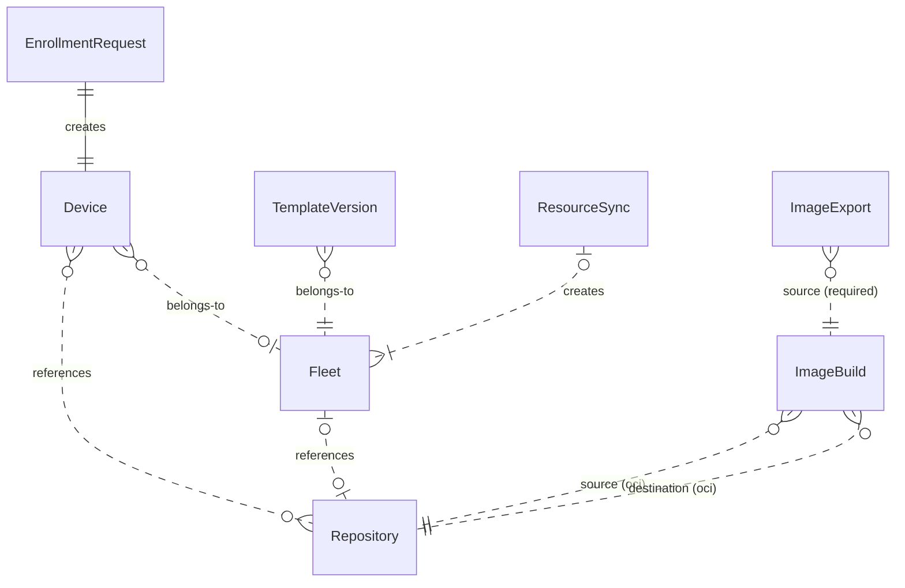

# API resources

This document serves as a high-level overview of the various resources defined by the flightctl API.  You may view and interact with these resources via the API, CLI, or UI.

You may configure your edge devices by specifying their configurations directly to flightctl or maintain the configurations in one or more git repositories and use GitOps to synchronize the configurations.

## General structure

Resources in flightctl are modeled after Kubernetes resources.  Each resource has the following fields:

* apiVersion: Defines the versioned schema of this representation of an object. Servers should convert recognized schemas to the latest internal value and may reject unrecognized values.  More information can be found in the [Kubernetes API Conventions](https://git.k8s.io/community/contributors/devel/sig-architecture/api-conventions.md#resources).
* kind: A string value representing the REST resource this object represents. Servers may infer this from the endpoint to which the client submits requests.  It cannot be updated. More information can be found in the [Kubernetes API Conventions](https://git.k8s.io/community/contributors/devel/sig-architecture/api-conventions.md#types-kinds).
* metadata:
  * name: The name of the object used as an immutable identifier.
  * labels: Map of string keys and values that can be used to organize and categorize (scope and select) objects.
  * creationTimestamp: The time at which the object was created.
  * deletionTimestamp: The time at which the object was deleted.
  * generation: A sequence number representing a specific generation of the desired state. Populated by the system. Read-only.
  * owner: An object that owns this object, in "kind/name" format.
  * annotations: Properties set by the service.
  * resourceVersion: An opaque string that identifies the server's internal version of an object.
* spec: The desired state of the object.
* status: The current state of the object.

## API Versioning

Flight Control uses header-based API version negotiation. This allows clients to request specific API versions without changing endpoint URLs.

API versions are per-resource (e.g., Device, Fleet, Repository). Each resource can have different supported versions, allowing resources to evolve independently.

### Requesting a Specific Version

Include the `Flightctl-API-Version` header in your requests:

```bash
curl -H "Flightctl-API-Version: v1beta1" \
     https://api.flightctl.example.com/api/v1/devices
```

### Response Headers

| Header | Description |
|--------|-------------|
| `Flightctl-API-Version` | The version used for this response |
| `Deprecation` | Deprecation date in [RFC 9651](https://www.rfc-editor.org/rfc/rfc9651.html) format `@<epoch-seconds>` per [RFC 9745](https://www.rfc-editor.org/rfc/rfc9745.html); date can be in past (already deprecated) or future (will be deprecated) |
| `Vary` | Set to `Flightctl-API-Version` for cache differentiation |

### Version Negotiation

* If no version header is sent, the server uses the most stable supported version
* If an unsupported version is requested, the server returns HTTP 406 Not Acceptable with `Flightctl-API-Versions-Supported` header listing available versions
* For versioned resources, the response includes `Flightctl-API-Version` indicating which version was used

### Current Versions

| Version | Resources | Status | Support Guarantee |
|---------|-----------|--------|-------------------|
| v1beta1 | Device, Fleet, Repository, EnrollmentRequest, TemplateVersion, ResourceSync, CertificateSigningRequest, Event, AuthProvider, AuthConfig, Organization | Current | Supported throughout the 1.x.x major version |
| v1alpha1 | ImageBuild, ImageExport | Alpha | No breaking changes anticipated, but may evolve as the feature matures |

## Repositories

A repository resource defines how flightctl can access an external configuration source.  While flightctl currently supports git as the sole repository type, others may be added in the future.

## EnrollmentRequests

Once you boot a device that runs the flightctl agent, the agent will contact the service to create an EnrollmentRequest resource.

If you recognize this device, approve the enrollment request.  Doing so will cause flightctl to create a Device object corresponding to this enrollment request.  The Device resource is described in the next section.  When approving the enrollment request, you may optionally pass the following information:

* labels: A set of labels to apply to the device object that will be created
* approvedBy: The name of the approver

Approved enrollment requests remain in the system and serve as a record of who approved each device and when.

## Devices

The device resource represents an edge device that flightctl will manage.  A device can be managed individually or as part of a group.  A group of devices is called a Fleet.  The Fleet resource is described in the next section.

When managing a single device, you must describe what flightctl should deploy to the device using the `spec` property.  This includes the OS image to deploy, any additional configuration, and what the flightctl agent should monitor.  The configuration, specified in `spec.config` is a list of configuration items, where each can be any one of three types:

* Inline: File content is specified in [ignition](https://coreos.github.io/ignition/specs/) format directly in the device’s `spec.config`.
* Git: File content is stored in a git repository.  The device’s `spec.config` references a repository object, target revision (e.g., branch, tag, or hash), and a path in the git repository.
* Kubernetes Secret: File content is stored in a Kubernetes Secret.  Flightctl currently assumes that to use this feature, flightctl is running on Kubernetes and has sufficient permissions to access the referenced Secret on the cluster.

When managing a device as part of a Fleet, ensure the device object has appropriate labels set, as flightctl will use these labels to assign devices to fleets.  The device’s `spec` should be left empty, as flightctl will update it according to the fleet’s definition.  You can see what fleet a device belongs to by checking the `owner` property.

## Fleets

As mentioned, a fleet is a group of devices. A fleet’s definition has two main parts. The first is the `spec.selector` property, which defines how to select devices for this fleet according to their labels. The second is the `spec.template` property, which contains the configuration to be rolled out to each device.  This configuration is identical to the device configuration described above.

## TemplateVersions

Whenever flightctl detects changes to a fleet’s template, it creates a snapshot of the configuration called a TemplateVersion.  It freezes the configuration, so, for example, git branches and tags are translated to hashes.  Whenever a new valid template version object is created, flightctl will apply it to all devices belonging to the fleet.

## ResourceSyncs

To get a end-to-end GitOps experience, you can:

1. Define your fleet objects in a git repository in YAML format
2. Create a repository object that references the git repository
3. Create a resource sync object that specifies a file or directory in the repository containing the fleet definitions

Flightctl will periodically check for updates to the fleet definitions and apply them to the system.  This will, of course, trigger the creation of template version objects, that will trigger updating the devices in the fleets.

## ImageBuilds

An ImageBuild resource automates the process of building bootc container images with the Flight Control agent embedded. It handles generating a Containerfile, building the container image using podman, and pushing the built image to a destination registry.

An ImageBuild specifies:

* **Source**: A source bootc image from a Repository resource (type `oci`)
* **Destination**: Where to push the built image (a Repository resource with ReadWrite access)
* **Binding**: Whether to use early binding (embed enrollment certificate) or late binding (no certificate)

When you create an ImageBuild, Flight Control:

1. Generates a Containerfile that includes the Flight Control agent
2. Builds the container image using podman
3. Pushes the built image to the destination registry
4. Updates the ImageBuild status with the result

The ImageBuild status tracks the build progress through conditions: Pending, Building, Pushing, Completed, or Failed. On successful completion, the `status.imageReference` field contains the full image reference of the built image.

For more details, see [Managing Image Builds and Exports](../using/managing-image-builds.md).

## ImageExports

An ImageExport resource converts bootc container images into disk image formats (qcow2, vmdk or iso, etc.) suitable for provisioning physical or virtual devices. It uses `bootc-image-builder` to perform the conversion.

An ImageExport specifies:

* **Source**: An ImageBuild resource (required)
* **Format**: The disk image format (qcow2, vmdk or iso.)

When you create an ImageExport, Flight Control:

1. Retrieves the source image from the referenced ImageBuild
2. Converts the image to the specified format using bootc-image-builder
3. Pushes the exported disk image to the destination registry (from the ImageBuild destination)
4. Updates the ImageExport status with the result

The ImageExport status tracks the export progress through conditions: Pending, Converting, Pushing, Completed, or Failed.

For more details, see [Managing Image Builds and Exports](../using/managing-image-builds.md).

## Resource Relationships

* A device's configuration may reference zero or more repositories.  A repository may be referenced by zero or more devices.
* A fleet's configuration may reference zero or more repositories.  A repository may be referenced by zero or more fleets.
* A device may belong to zero or one fleet.  A fleet may have zero or more devices.
* Approving an enrollment request creates a single device.
* A fleet may have zero or more template versions.
* A resource sync may create one or more fleets.  A fleet may be created by zero or one resource sync.
* An ImageBuild references a source Repository and a destination Repository (both of type `oci`).
* An ImageExport references an ImageBuild as its source and uses the ImageBuild's destination.


