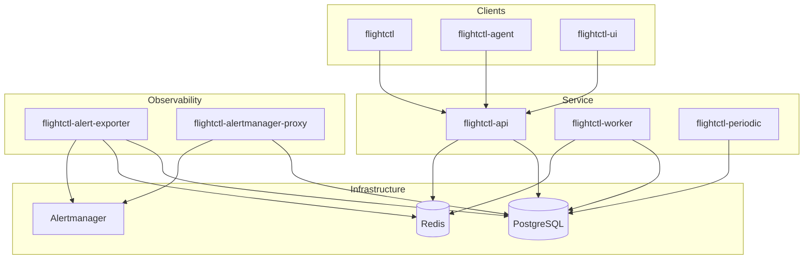

# Component Reference

This document provides an architectural overview of the Flight Control service components. Each component serves a specific purpose in the device fleet management system.

## Service Components

### flightctl-api

The primary API server that handles all REST and gRPC requests from clients and agents. It exposes two endpoints: one for user/CLI operations (HTTPS) and one for agent communication (mTLS).

**Overview:**

- Device enrollment and certificate signing
- Fleet and device configuration management
- TemplateVersion creation and validation
- Remote console session management
- Metrics collection and exposure

**Dependencies:** PostgreSQL, Redis

### flightctl-ui

The web-based user interface for managing Flight Control resources.

**Overview:**

- Resource management (enrollment, fleets, devices, repositories, templates)
- Remote console access
- Review resource YAML

**Dependencies:** flightctl-api

### flightctl-worker

An asynchronous task processor that handles background operations. It processes tasks queued by the API server and also queues its own operations (for example, updating a device's owner due to label selection, which triggers a rollout).

**Overview:**

- TemplateVersion rendering
- Git repository synchronization
- Fleet rollout execution
- Device configuration rendering
- Device ownership updates

**Dependencies:** PostgreSQL, Redis

### flightctl-periodic

A scheduler service that runs periodic maintenance tasks against the database. Runs as a singleton to avoid duplicate task execution.

**Overview:**

- Marking devices offline when heartbeats are missed
- Repository health testing
- ResourceSync polling
- Rollout device selection and disruption budget reconciliation
- Event cleanup

**Dependencies:** PostgreSQL

### flightctl-agent

The device side agent that runs on each managed device. It handles the full device lifecycle from enrollment through ongoing configuration and application management.

**Overview:**

- Device enrollment and certificate management
- Fetching desired configuration from the service
- OS image updates
- Configuration file deployment
- Application lifecycle management (containers, systemd services)
- Status reporting

**Dependencies:** flightctl-api (enrollment and management endpoints)

### flightctl-db-migrate

A utility for running database schema migrations.

**Overview:**

- Applying pending database schema changes
- Validating migrations

**Dependencies:** PostgreSQL

### flightctl-restore

A post-restore utility that prepares devices after database restoration from backup.

**Overview:**

- Invalidating caches and preparing devices to resume after disaster recovery

**Dependencies:** PostgreSQL, Redis

## Authentication Components

### flightctl-pam-issuer

An OIDC token issuer that authenticates users via PAM (Pluggable Authentication Modules). Used in Linux standalone deployments.

**Overview:**

- Authenticating users against local system credentials
- Issuing JWT tokens for API access

**Platform:** Linux only

### flightctl-userinfo-proxy

A proxy service that translates Ansible Automation Platform (AAP) user API responses into OpenID Connect UserInfo format.

**Overview:**

- Transforming AAP user responses to OIDC UserInfo format

**Dependencies:** Ansible Automation Platform

## Observability Components

### flightctl-telemetry-gateway

An OpenTelemetry-based gateway for collecting and forwarding telemetry data from devices.

**Overview:**

- Receiving telemetry from agents via OTEL protocol (metrics, traces)
- Routing telemetry to configured backends

**Dependencies:** Observability backend (Prometheus)

### flightctl-alert-exporter

Monitors device and fleet events to generate alerts based on configured rules.

**Overview:**

- Processing Flight Control events
- Generating Prometheus-compatible alerts
- Forwarding alerts to Alertmanager

**Dependencies:** PostgreSQL, Redis, Alertmanager

### flightctl-alertmanager-proxy

A reverse proxy for Alertmanager that integrates with Flight Control authentication.

**Overview:**

- Checking user permissions for alert access
- Proxying requests to Alertmanager

**Dependencies:** PostgreSQL, Alertmanager

## CLI and Utilities

### flightctl

The command-line interface for interacting with the Flight Control service. Provides commands for managing devices, fleets, repositories, and other resources.

**Overview:**

- Resource CRUD operations
- Device enrollment approval
- Remote console access
- Certificate management

**Dependencies:** flightctl-api

### flightctl-standalone

A collection of utilities for standalone Linux deployments.

**Overview:**

- Rendering systemd quadlet files
- Rendering configuration templates

**Dependencies:** None

## Component Dependencies

