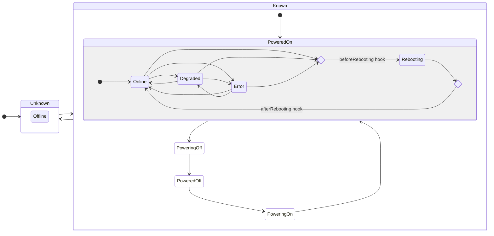
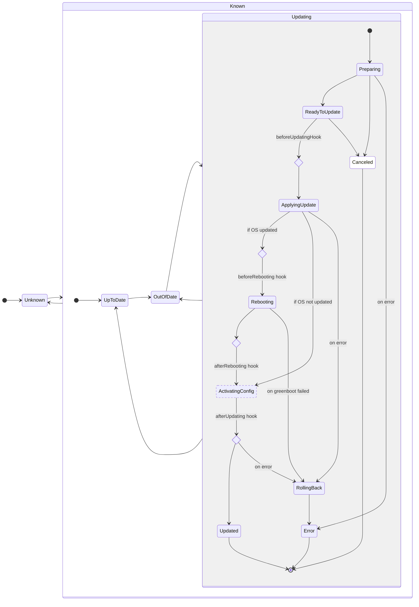
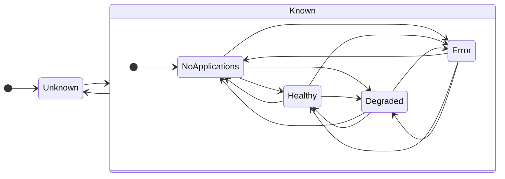
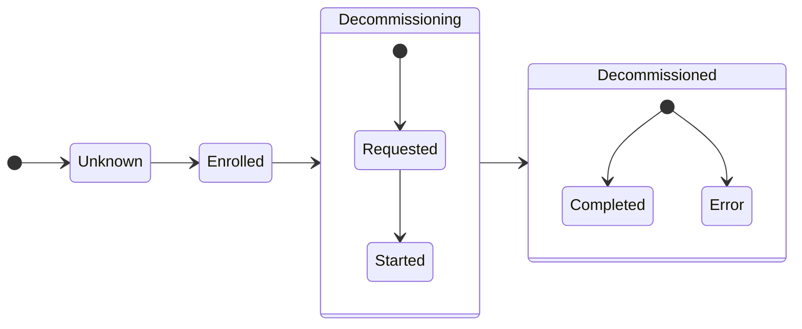

# Device API Statuses

The following sections document the various statuses reported by Flight Control's Device API. These statuses represent the _service's view_ of the managed device, which is the _last reported_ status from the device agent augmented by service's local context and user policies. The _last reported_ status in turn may be outdated relative to the agent's _current status_ due to reporting delays.

## Device Status

The Device Status represents the availability and health of the device's hardware resources and operating system.

The `device.status.summary` field can have the following values:

| Status              | Description                                                                                                                            | Formal Definition<sup>1</sup> |
|---------------------|----------------------------------------------------------------------------------------------------------------------------------------| ----------------------------- |
| `Online`            | All hardware resources and operating system services are reported to be healthy.                                                       | `!deviceIsDisconnected && !deviceIsRebooting && ∀ r∈{CPU, Memory, Disk}, status.resources[r]∈{Healthy}` |
| `Degraded`          | One or more hardware resources or operating system services are reported to be degraded but in a still functional or recovering state. | `!deviceIsDisconnected && !deviceIsRebooting && ∀ r∈{CPU, Memory, Disk}, status.resources[r]∉{Error, Critical} && ∃ r∈{CPU, Memory, Disk}, status.resources[r]∈{Degraded}` |
| `Error`             | One or more hardware resources or operating system services are reported to be in error or critical state.                             | `!deviceIsDisconnected && !deviceIsRebooting && ∃ r∈{CPU, Memory, Disk}, status.resources[r]∈{Error, Critical}` |
| `Rebooting`         | The device is rebooting.                                                                                                               | `!deviceIsDisconnected && deviceIsRebooting` |
| `Offline`           | The device is disconnected from the service but may still be running.                                                                  | `deviceIsDisconnected` |
| `AwaitingReconnect` | The device is awaiting reconnection after the system was restored.                                                                     | `deviceIsDisconnected` |
| `ConflictPaused`    | The device is paused because the device reported a renderedVersion not known to the service.                                           | `deviceIsDisconnected` |

<sup>1</sup> For the detailed definitions derived from the device specs and statuses, see [Helper Definitions](#helper-definitions).

The following state diagram shows the possible transitions between device statuses, including when the corresponding device lifecycle hooks would be called.



## Device Update Status

The Device Update Status represents whether the device's currently running specification (OS, configuration, applications, etc.) matches the user's intent as expressed via the device spec or the fleet's device template.

The `device.status.updated.status` field can have the following values:

| Status | Description | Formal Definition<sup>1</sup> |
| ------ | ----------- | ----------------------------- |
| `UpToDate` | The device is updated to its device spec. If the device is member of a fleet, its device spec is at the same template version as its fleet's device template. | `!deviceIsUpdating && deviceIsUpdatedToDeviceSpec && (deviceIsNotManaged \|\| deviceIsUpdatedToFleetSpec)` |
| `Updating` | The device is in the process of updating to its device spec. | `deviceIsUpdating` |
| `OutOfDate` | The device is not updating and either not updated to its device spec or - if it is member of a fleet - its spec is not yet of the same template version as its fleet's device template. | `!deviceIsUpdating && (!deviceIsUpdatedToDeviceSpec \|\| (deviceIsManaged && !deviceIsUpdatedToFleetSpec))` |
| `Unknown` | The device's agent either never reported status or its last reported status was `Updating` and the device has been disconnected since. | `deviceIsDisconnected && lastStatus == Updating` |

<sup>1</sup> For the detailed definitions derived from the device specs and statuses, see [Helper Definitions](#helper-definitions).

The `device.status.conditions.Updating.Reason` field contains the current state of the update in progress and can take the following values:

| Update State | Description |
| ------------ | ----------- |
| `Preparing` | The agent is validating the desired device spec and downloading dependencies. No changes have been made to the device's configuration yet. |
| `ReadyToUpdate` | The agent has validated the desired spec, downloaded all dependencies, and is ready to update. No changes have been made to the device's configuration yet. |
| `ApplyingUpdate` | The agent has started the update transaction and is writing the update to disk. |
| `Rebooting` | The agent initiated a reboot required to activate the new OS image and configuration. |
| `ActivatingConfig` | (transient, not reported) The agent is activating the new configuration without requiring a reboot. |
| `RollingBack` | The agent has detected an error and is rolling back to the pre-update OS image and configuration. |
| `Updated` | The agent has successfully completed the update and the device is conforming to its device spec. Note that the device's update status may still be reported as `OutOfDate` if the device spec is not yet at the same version as the fleet's device template. |
| `Error` | The agent failed to apply the desired spec and will not retry. The device's OS image and configuration have been rolled back to the pre-update version and have been activated. |

The `device.status.updated.info` field contains a human readable more detailed information about the last state transition.

The following state diagram shows the possible transitions between update statuses and states, including when the corresponding device lifecycle hooks would be called.



### OS delta status

You can inspect delta eligibility and the result of an OS delta update in the device's YAML or JSON output:

```console
flightctl get device <device_name> -o yaml
```

The following device status fields describe delta capability and the result for the desired OS image:

| Field | Description |
| ----- | ----------- |
| `device.status.systemInfo.deltaEligible` | `true` when the agent has the `oci-delta` tool available. This field may be absent when an older agent does not report it. |
| `device.status.os.lastDelta.outcome` | The agent-reported OS result. `NotUsed` means delta application was skipped without a delta failure, `Applied` means the delta was applied, and `Fallback` means a delta attempt failed and the agent attempted a full image pull. The field is omitted until an outcome is reported. |
| `device.status.os.lastDelta.fallbackReason` | The reason for a recorded delta pull or apply failure. It is omitted when the recorded outcome has no fallback reason. |
| `device.status.os.deltaSize` | Expected payload size in IEC units, such as MiB or GiB, for a control-plane-generated OS delta. The field is omitted when no delta was generated or its size is unknown. |

OS delta application also requires bootc. Delta eligibility does not enforce a bootc 1.15.0 minimum.

OS outcomes persist across agent restarts for the same desired OS image. If no matching delta is found, the agent records `NotUsed` only when that image has no recorded outcome. Otherwise, it retains the existing outcome, including a previous `Fallback` and its reason. An already running or cached OS image is also recorded as `NotUsed` only when that image has no recorded outcome.

The size field describes a control-plane-generated delta payload. It does not measure downloaded bytes, CI-published delta size, full OS image size, total update size, or update duration.

The default and wide device tables do not show these fields. Device summary capability counts include `osMode` only. Use YAML or JSON output to inspect per-device delta status.

## Application Status

The Application Status represents a summary of the availability and health of all applications on the system.

The `device.status.applicationSummary` field can have the following values:

| Status | Description | Formal Definition<sup>1</sup> |
| ------ | ----------- | ----------------------------- |
| `NoApplications` | No applications are defined for the device. | `!deviceIsDisconnected && len(status.applications) == 0` |
| `Healthy` | All applications are reported to be in service or have successfully completed. | `!deviceIsDisconnected && len(status.applications) > 0 && ∀ a∈status.applications, status.applications[a]∈{Running, Completed}` |
| `Degraded` | One or more applications are reported to not be in service but still in a starting or recovering state. | `!deviceIsDisconnected && ∀ a∈status.applications, status.applications[a]∉{Error} && ∃ a∈status.applications, status.applications[a]∈{Preparing, Starting}` |
| `Error` | One or more applications are reported to be in error state. | `!deviceIsDisconnected && ∃ a∈status.applications, status.applications[a]∈{Error}` |
| `Unknown` | The device's agent either never reported status or the device is currently disconnected. | `deviceIsDisconnected` |

<sup>1</sup> For the detailed definitions derived from the device specs and statuses, see [Helper Definitions](#helper-definitions).

The following state diagram shows the possible transitions between application summary statuses.



### Application delta status

Each application's delta result appears in `device.status.applications[].lastDelta`. For applications with multiple image targets, the result is aggregated across those targets.

| Field | Description |
| ----- | ----------- |
| `device.status.applications[].lastDelta.outcome` | The agent-reported application result, as described in the following table. The field is omitted until the agent reports an outcome. |
| `device.status.applications[].lastDelta.fallbackReason` | One representative failure reason when a delta attempt failed and the agent attempted a full image pull. It can accompany `Fallback` or `Partial`. |
| `device.status.applications[].deltaSize` | Expected total size of control-plane-generated delta payloads for the application, in IEC units. Full image sizes are excluded. The field is omitted when no delta was generated or any generated delta size is unknown. |

The application delta outcome can have the following values:

| Outcome | Description |
| ------- | ----------- |
| `NotRequired` | All image targets are already present on the device with the correct digest. No delta application or image pull is needed. |
| `NotUsed` | Delta application was skipped without a delta failure. A full image pull may still be needed. |
| `Applied` | At least one delta was applied successfully. Other image targets also applied deltas or already matched their desired digests. |
| `Fallback` | No image target successfully applied a delta, and at least one delta attempt failed. The agent attempted a full image pull for the failed targets. |
| `Partial` | At least one image target applied a delta, while another skipped delta application or fell back to a full image pull. Already matching targets do not cause `Partial`. |

Results persist across agent restarts while the application specification and image targets remain unchanged. A cache check can change an earlier `NotUsed` result to `NotRequired` after verifying the desired digest. Cache checks retain earlier `Applied` or `Fallback` results for the same target.

## Lifecycle status

The Lifecycle Status represents whether the device is available to be managed and assigned to do work or is moving to an end-of-life state.

The `device.status.lifecycle` field can have the following values:

| Status | Description | Formal Definition<sup>1</sup> |
| ------ | ----------- | ----------------------------- |
| `Enrolled` | The device's Enrollment Request was approved and it will be able to connect to management to carry out normal operations using its management certificate. | `enrollmentCompleted(device) && device.spec.decommissioning == nil` |
| `Decommissioning` | The device has been requested to decommission by a user and is no longer available to carry out normal operations. | `enrollmentCompleted(device) && device.spec.decommissioning != nil && (device.conditions["DeviceDecommissioning"] == nil \|\| !(device.conditions["DeviceDecommissioning"].reason ∈ {Completed, Error}))` |
| `Decommissioned` | The device has either completed its decommissioning process or has encountered an unrecoverable error in doing so. | `enrollmentCompleted(device) && device.spec.decommissioning != nil && device.conditions["DeviceDecommissioning"].reason ∈ {Completed, Error}` |
| `Unknown` | No device available through management should be in this state. | `!enrollmentCompleted(device)` |

<sup>1</sup> For the detailed definitions derived from the device specs and statuses, see [Helper Definitions](#helper-definitions).
For the allowed transitions between these Statuses, see the [state diagram](#state-diagram-for-device-lifecycle) below.

The `device.status.conditions` field may contain a Condition of type `DeviceDecommissioning` whose `Condition.Reason` field contains the current state of a device's progress on a request to decommission that it has received. It can contain the following values:

| Decommissioning State | Description |
| ------------ | ----------- |
| `Started` | The agent has received the request to decommission from the service and will take a series of previously defined decommissioning actions. |
| `Completed` | The agent has completed its decommissioning process, up until the point of wiping its management certificate that is used to communicate with the service. |
| `Error` | The agent has encountered an unrecoverable error during its decommissioning process and will not be able to take further actions. |

NOTE: the Decommissioning State reflects the device perspective. It is possible for the user to request decommissioning (the device will be marked as "decommissioning" server-side) but for the device not to have received this request. This corresponds to the Requested state in the diagram below.

The following state diagram shows the possible transitions between lifecycle statuses and states. Note that none of these transitions are guaranteed to occur, and the device may remain in any one of these states indefinitely, including the Decommissioning state.

### State diagram for device lifecycle



## Helper Definitions

The formal definition uses the following helper definitions:

```golang
// A device is assumed disconnected if its agent hasn't sent an update for the duration of a disconnectionTimeout.
deviceIsDisconnected := device.lastSeen + disconnectionTimeout < time.Now()

// A device is not managed by a fleet if its owner field is unset.
deviceIsNotManaged := len(device.metadata.owner) == 0

// A device is rebooting when the agent sets the "Rebooting" condition to true.
deviceIsRebooting := device.status.conditions.rebooting == true

// A device is updating when the agent sets the "Updating" condition to true.
deviceIsUpdating := device.status.conditions.updating == true

// A device is updated to its device spec when the version of the device spec that the agent reports as running
// equals the version rendered to the device by the service.
deviceIsUpdatedToDeviceSpec := device.status.config.renderedVersion == device.metadata.annotations.renderedVersion

// A device is updated to it's fleet's spec when it is updated to its device spec and that device spec's
// template version matches the device's fleet's template version.
deviceIsUpdatedToFleetSoec := deviceIsUpdatedToDeviceSpec && device.metadata.annotations.templateVersion == fleet[device.metadata.owner].spec.templateVersion

// A device has completed enrollment if there exists an EnrollmentRequest record with the device's ID and that record contains a valid `er.status.certificate`.
enrollmentCompleted := enrollmentRequests[device.metadata.name] != nil && enrollmentRequests[device.metadata.name].status.certificate != nil
```
